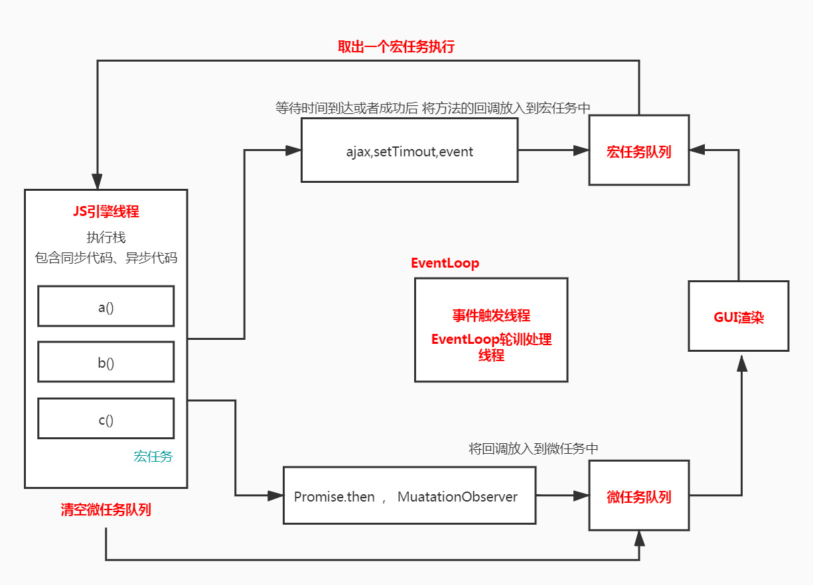
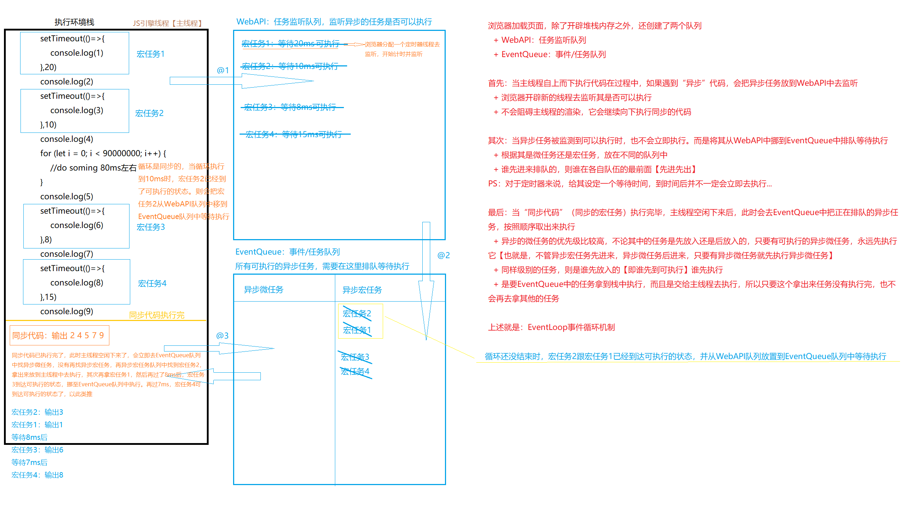
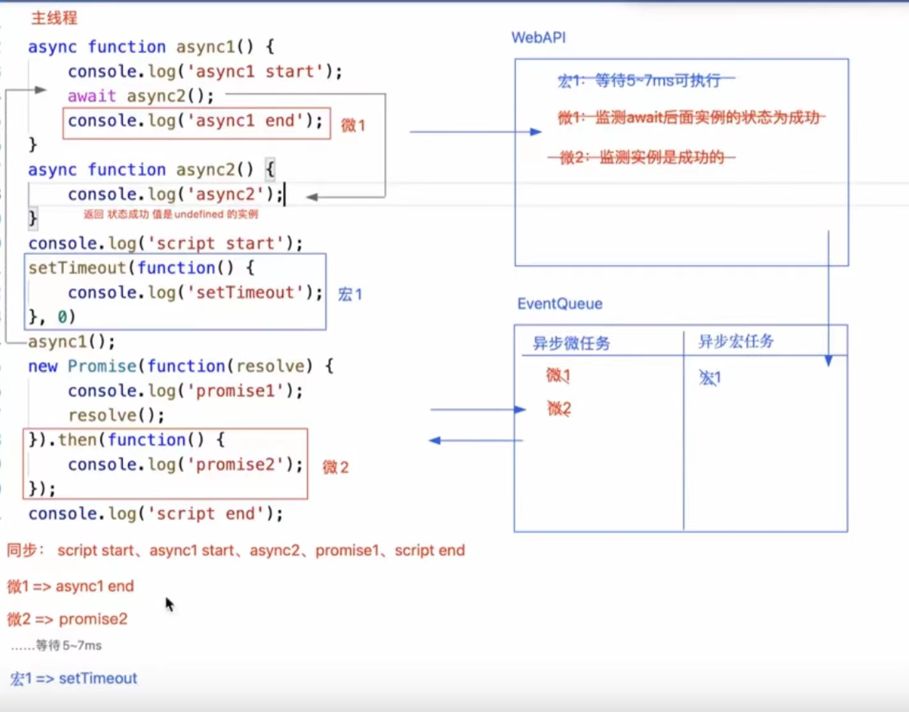
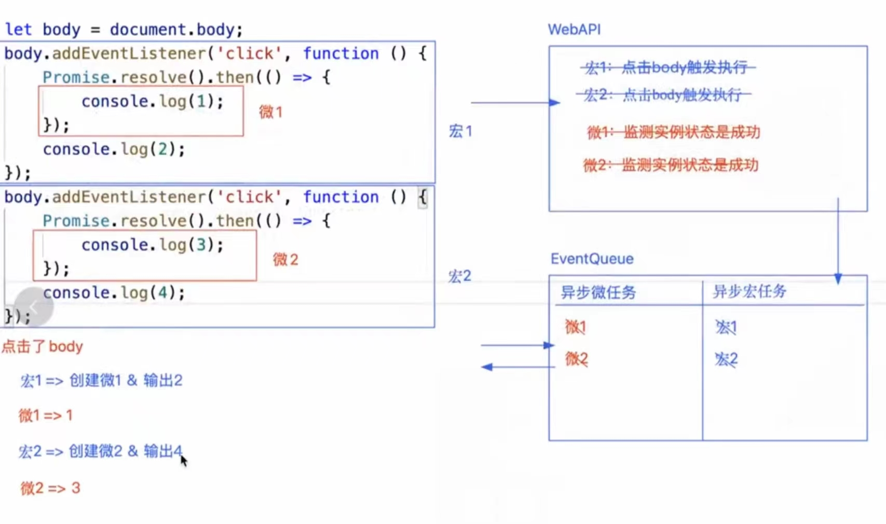

### 前端开发中的同步异步编程

#### 进程与线程

>一个程序相当于一个进程，例如浏览器打开一个页卡。而线程就是程序中具体做事的人，例如浏览器中负责渲染的渲染进程

##### 浏览器是多线程的

+ GUI渲染线程 ：渲染和解析页面
+ JS引擎线程：渲染和解析JS （浏览器只会分配一个线程是解析JS，所以JS是单线程的）
+ 事件触发线程
+ 定时监听器线程
+ HTTP网络请求线程：包括AJAX和资源请求等（同源下，浏览器最多同时分配5~7个HTTP线程）
+ `WebWorker`
+ ...


##### JS是"单线程"运行的，所以其中大部分代码是“同步”的（例如：循环...）、

```js
console.time('AA')
for(let i = 0; i < 99999999; i++){}
console.timeEnd('AA')
console.log('ok')
//AA: 40.098876953125 ms
//ok
```

##### 但是JS中也有部分"异步"操作的代码

+ 异步微任务
  + `requestAnimationFrame `【有争议】
  + `Promise.then/catch/finally`
  + `async/await`
  + `queueMicrotask`
  + `process.nextTick`【node】
  + `MutationObserver`
  + `IntersectionObserver`

+ 异步宏任务
  + `setTimeout/setInterval`
  + 事件绑定/队列
  + `XMLHttpRequest/Fetch`
  + `setImmediate` 【node】
  + `MessageChannel`

##### JS中的异步操作是借用浏览器的多线程机制，再基于`EventLoop`事件循环机制实现的单线程异步效果



```js
setTimeout(()=>{
  console.log(1)  
},0)
//也不是立即执行定时器，而是需要等待5~7ms【浏览器的最快处理时间】
```

例题：

```js
setTimeout(()=>{
    console.log(1)
},20)
console.log(2)
setTimeout(()=>{
    console.log(3)
},10)
console.log(4)
for (let i = 0; i < 90000000; i++) {
    //do soming 80ms左右
}
console.log(5)
setTimeout(()=>{
    console.log(6)
},8)
console.log(7)
setTimeout(()=>{
    console.log(8)
},15)
console.log(9)
// 2
// 4
// 5
// 7
// 9
// 3
// 1
// 6
// 8
```

图解



例题





例题3【相对特殊】

```js
Promise.resolve().then(() => {
    console.log("then1");
    Promise.resolve().then(() => {
        console.log("then1-1");
       return Promise.resolve(); // x.then().then()
    }).then(() => {
        console.log("then1-2");
    });
})
.then(() => {
    console.log("then2");
})
.then(() => {
    console.log("then3");
})
.then(() => {
    console.log("then4");
})
.then(() => {
    console.log("then5");
})    
    
    
// promise + 遵循 ecmascript262规范
//  默认会先注册这第一个then方法  then1   then1-1  then2  then3   then4 then1-2
// [then1-2,then4]

// 微任务执行的顺序是按照放置的顺序

// 同步代码执行完毕后:
// 微任务队列 [then1] 
// 1.清空微任务队列                    ---输出then1
// 微任务队列 j [then1-1,then2]          
// 2.依次继续清空微任务队列             ---输出then1-1,then2
// 微任务队列 [NewPromiseResolveThenableJob，then3]
// 3.依次继续清空微任务队列             ---输出then3
// 微任务队列 [Promise.resolve().then,then4]

// NOTE
// This Job uses the supplied thenable and its then method to resolve the given promise. This process must take place as a Job to ensure that the evaluation of the then method occurs after evaluation of any surrounding code has completed.
```

