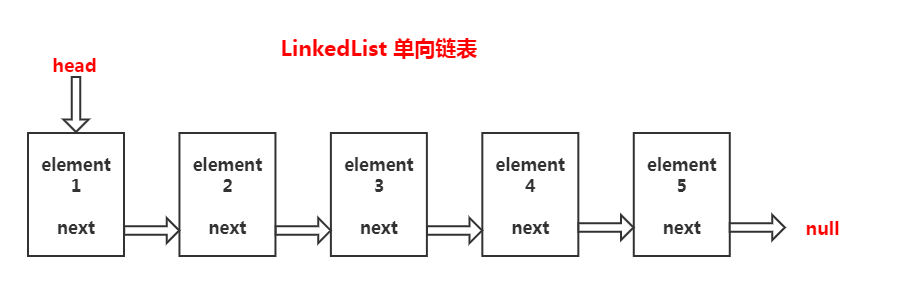

### 1.前言

常见的数据结构：队列 栈  链表  树

```js
// 队列:先进先出跟数组的push、shift方法类似，像事件环就是队列结构
// 栈：先进后出跟数组的push、pop方法类似，像方法调用栈、路由切换、浏览器的历史记录【是两个两个栈】
```

典型的栈型结构

```js
//错误的说法：函数每次执行的时候都会创建一个作用域，这句话是有问题的，作用域是在声明时就已经定义了。运行时产生的是执行上下文
function a(){
    function b(){
        function c(){
        }
        c()
    }
    b()
}
a()
```

另一方面数组的shift在一定的长度时是比较浪费性能的：每次shift掉一项时，都会导致后续的内容前进。所以才会产生了链表的概念【链表：通过指针连接起来】

链表的查找、删除的性能平均复杂度是O(n)，链表相比于数组结构只是优化了头尾的操作，另外我们可以使用链表来实现栈或者队列

### 2.什么是链表

+ 单向链表

各个节点数据通过指针的方法串联起来,构成链表。（单向指针）



实现单向链表

```js
//常见的数据结构：队列 栈 链表 树
//

class Node {
    constructor(element, next) {
        this.element = element;
        this.next = next;
    }
}
class LinkedList {
    constructor() {
        this.head = null;
        this.size = 0;
    }
    add(index, element) {
        if (arguments.length == 1) {
            element = index; //当参数为一个时，所传进来的参数即是element
            index = this.size;
        }
        if (index < 0 || index > this.size) throw new Error('链表索引异常')
        if (index == 0) {
            let head = this.head;
            this.head = new Node(element, head)
        } else {
            let prevNode = this.getNode(index - 1)
            prevNode.next = new Node(element, prevNode.next);
        }
        this.size++
    }
    remove(index) {
        if(this.size == 0) return null;
        let oldNode；
        if (index == 0) {
            oldNode = this.head;
            this.head = oldNode && oldNode.next;
        } else {
            let prevNode = this.getNode(index - 1)//获取当前的节点
            oldNode = prevNode.next;//前一个节点的下一个节点就是需要删除的节点
            prevNode.next = oldNode.next//让前一个节点的下一个指向前一个节点的下一个
        }
        this.size--;
        return oldNode && oldNode.element
    }
    getNode(index) {
        let current = this.head;
        for (let i = 0; i < index; i++) {
            current = current.next
        }
        return current
    }
    length() {
        return this.size;
    }
}

let ll = new LinkedList();
ll.add(0, 100)
ll.add(0, 200)
ll.add(300)
ll.remove(0)
console.log(ll.head)
```

将链表排成队列结构

```js
const LinkedList = require('./LinkedList')
//队列是 添加跟删除方法
class Queue {
    constructor() {
        this.ll = new LinkedList();
    }
    offer(element) { //加入队列
        this.ll.add(element)
    }
    pool() { //删除队列
        return this.ll.remove(0)
    }
}
module.exports = Queue
```

将之前自己实现的可写流中数组替换成我们的链表结构

```js
const fs = require("fs");
const EventEmitter = require('events')
const Queue = require('./Queue')
class WriteStream extends EventEmitter {
    constructor(path, options = {}) {
        super();
        this.path = path;
        this.flags = options.flags || 'w';
        this.encoding = options.encoding || 'utf8';
        this.autoClose = options.autoClose || true;
        this.highWaterMark = options.highWaterMark || 16 * 1024;
        this.open();
        //需要判断是第一次写入还是后续的写入

        this.writing = false; //是否正在写入的标志
        this.needDrain = false;//是否触发drain事件
        this.len = 0 //统计写入的长度，默认0 累加
        this.offest = 0;//每次写入时的偏移量
        //缓存区 这里使用数组了，原本是使用链表的
        this.cache = new Queue; //实现缓存的
    }
    open() {
        fs.open(this.path, this.flags, (err, fd) => {
            if (err) return this.emit('error', err);
            this.fd = fd;
            this.emit('open', fd);
        })
    }
    //这里有两write是因为用户调用write时，需要判断当前是否是真的写入还是写入缓存中
    write(chunk, encoding = this.encoding, cb = () => { }) {//chunk:写入的内容,encoding：编码格式
        //这里判断是写入还是缓存\
        //用户调用write方法时传入的内容可能是buffer类型或者是string类型
        chunk = Buffer.isBuffer(chunk) ? chunk : Buffer.from(chunk);
        this.len += chunk.len;
        let ret = this.len < this.highWaterMark;
        if (!ret) {
            this.needDrain = true;
        }
        if (this.writing) {
            this.cache.offer({
                chunk,
                encoding,
                cb
            })
        } else {
            this.writing = true;
            this._write(chunk, encoding, () => {
                //先执行用户传递进来的cb
                cb();
                //清空缓存
                this.clearBuffer();
            })
        }
        return ret
    }
    clearBuffer() {
        let data = this.cache.poll();
        if (data) {
            let { chunk, encoding, cb } = data;
            this._write(chunk, encoding, () => {
                cb();
                //循环
                this.clearBuffer();
            })
        } else {
            //缓存中的需要写入的内容也全部写进去了。
            this.writing = false;
            //写完之后，查看需要需要触发drain事件
            if (this.needDrain) {
                this.needDrain = false;
                this.emit('drain')
            }
        }
    }
    _write(chunk, encoding, cb) {
        //这里是真是的写入操作即调用fs.write
        //在这里是拿不到fd的，所以还需要在绑一侧open事件
        if (typeof this.fd !== 'number') {
            return this.once('open', () => this._write(chunk, encoding, cb))
        }
        // console.log('this.fd',this.fd)
        fs.write(this.fd, chunk, 0, chunk.length, this.offest, (err, written) => {
            this.len -= written;
            this.offset += written;
            cb();
            //写完之后需要清楚缓存
            console.log(this.cache)
        })
    }
}

module.exports = WriteStream;
```

链表的反转


+ 