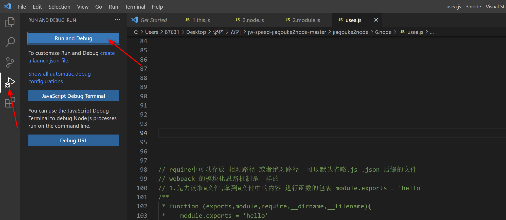
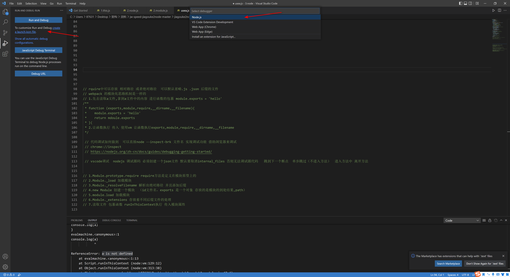
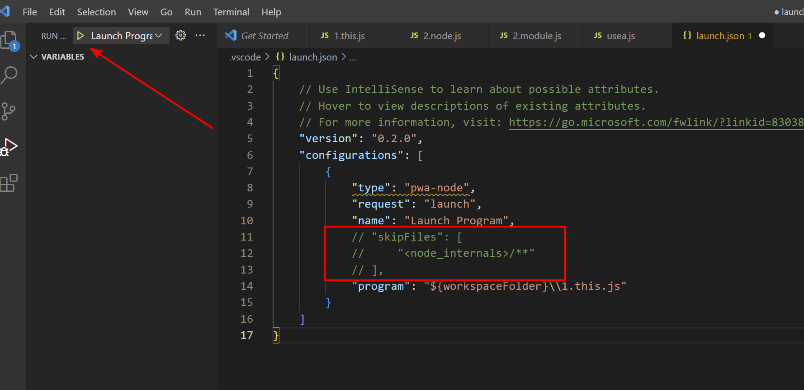
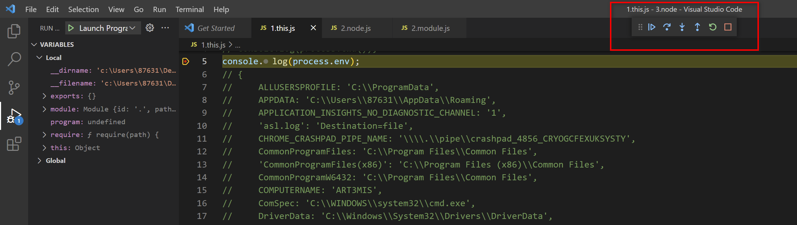
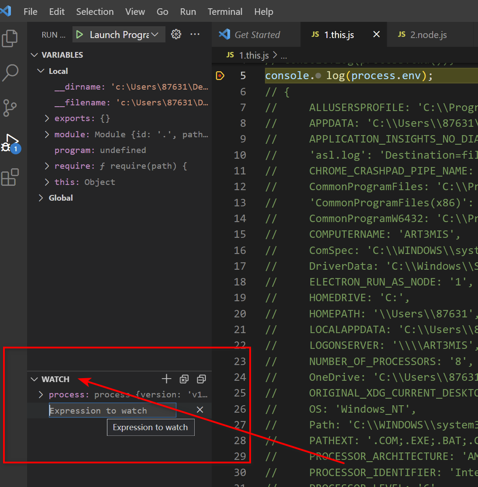
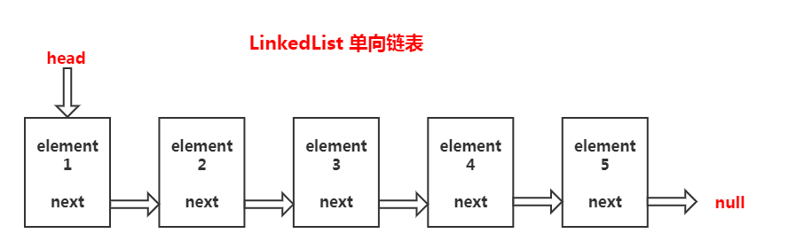

### 1.Node基本概念

##### Node是什么?

Node.js是一个基于 Chrome V8 引擎的JavaScript运行环境(runtime),Node不是一门语言是让js运行在后端的运行时,并且不包括javascript全集,因为在服务端中不包含DOM和BOM,Node也提供了一些新的模块例如http,fs模块等。Node.js 使用了事件驱动、非阻塞式 I/O 的模型，使其轻量又高效并且Node.js 的包管理器 npm，是全球最大的开源库生态系统。事件驱动与非阻塞IO后面我们会一一介绍。到此我们已经对node有了简单的概念。

##### Node解决了哪些问题?

Node在处理高并发,I/O密集场景有明显的性能优势

- 高并发,是指在同一时间并发访问服务器
- I/O密集指的是文件操作、网络操作、数据库,相对的有CPU密集,CPU密集指的是逻辑处理运算、压缩、解压、加密、解密

> Web主要场景就是接收客户端的请求读取静态资源和渲染界面,所以Node非常适合Web应用的开发。

##### JS单线程

javascript在最初设计时设计成了单线程,为什么不是多线程呢？如果多个线程同时操作DOM那岂不会很混乱？这里所谓的单线程指的是主线程是单线程的,所以在Node中主线程依旧是单线程的。

- 单线程特点是节约了内存,并且不需要在切换执行上下文
- 而且单线程不需要管锁的问题.

##### 同步异步和阻塞非阻塞

- 同步就是在执行某段代码时，代码没有得到返回之前，其他代码无法执行，当得到了返回值后可以继续执行其他代码。
- 异步就是在执行某段代码时，代码不会立即得到返回结果，可以继续执行其他代码，返回值通过回调来获取


### 2.Node中的全局对象

> 浏览器中的this指代的是window，而服务端中的this指代的是global。

在CMD命令行中输入`node`后打印this则是global

```shell
> this
<ref *1> Object [global] {...}
```

而在js文件中访问的this则是被内部更改过了的。不是global而是module.exports

```js
console.log(this)
//{}

function a(){
    console.log(this)
}
a();
//global
//这样子调用输出this就是global
```

#### 全局对象process

常用的几个

##### `process.platform` ：获取执行当前node命令的平台

```js
console.log(process.platform);
//win32
```

##### `process.cwd` ：获取执行当前node命令的目录

```js
console.log(process.cwd());
//c:\Users\87631\Desktop\test\node\3.node
```

##### `process.chdir ` : 更改执行当前node命令的目录

```js
console.log(process.chdir('a')); //一般用不到这个指令
//undefined 更改完成之后返回的是undefined
```

##### `process.env` ：环境变量

```js
console.log(process.env);
//当前操作系统的环境变量
// {
//     ALLUSERSPROFILE: 'C:\\ProgramData',
//     LOCALAPPDATA: 'C:\\Users\\87631\\AppData\\Local',
//     LOGONSERVER: '\\\\ART3MIS',
//     NUMBER_OF_PROCESSORS: '8',
//     OneDrive: 'C:\\Users\\87631\\OneDrive',
//     ORIGINAL_XDG_CURRENT_DESKTOP: 'undefined',
//     OS: 'Windows_NT',
//     Path: 'C:\\WINDOWS\\system32;C:\\WINDOWS;C:\\WINDOWS\\System32\\Wbem;C:\\WINDOWS\\System32\\WindowsPowerShell\\v1.0\\;C:\\WINDOWS\\System32\\OpenSSH\\;C:\\Program Files\\Bandizip\\;C:\\Program Files\\nodejs\\;C:\\Users\\87631\\AppData\\Local\\Microsoft\\WindowsApps;C:\\Program Files (x86)\\Tencent\\QQGameTempest\\Hall.57773\\;C:\\Users\\87631\\AppData\\Local\\Programs\\Microsoft VS Code\\bin;C:\\Users\\87631\\AppData\\Roaming\\npm',
//     PATHEXT: '.COM;.EXE;.BAT;.CMD;.VBS;.VBE;.JS;.JSE;.WSF;.WSH;.MSC',
//     ...
//     windir: 'C:\\WINDOWS',
//     __COMPAT_LAYER: 'DetectorsAppHealth'
//   }


//使用命令行设置环境变量
//Windows：set xxx=xxx
//mac: export xxx=xxx

//也可以使用cross-env第三方模块包进行设置环境变量 【不需要区分操作系统】
//设置环境变量的作用主要是在使用webpack时区分时开发环境还是生产环境
if(process.env == 'production'){
     console.log('生产环境')
}else{
    console.log('开发环境')
}
```

##### `process.argv` : 获取运行代码时传入的参数

```js
//cmd
>node 2.node.js a b c d 
console.log(process.argv.slice(2)) //可以获取到用户传入的所有参数
//...
//'a'
//'b'
//'c'
//'d'


//但是我们一般传入参数时是这样的写法：node 2.node.js --port 3000 --config xx.js
//=> ['--port','3000','--config','xx.js']
//但是使用者希望拿到的是键值对的形式 ==> {prot:3000,config:xx.js}
let config = process.argv.slice(2).reduce((memo,current,index,arr) => {
	 if(memo.startsWith('--')){
         memo[current.slice(2)] = arr[index + 1]
     }
    return memo
},{})
console.log(config)
//{prot:'3000',config:'xx.js'}

```

```js
//也可以使用第三方包 commander来实现上述的功能 【写脚手架，写包都会用到】
 const program = require('commander'); // 解析用户传递的参数 
 program.name('test')
 program.usage('[options]')
 program.command('rm').action(function () {
     console.log('删除')
 })
 program.option('-p, --port <v>','set server port') 
 program.parse(process.argv)
```

##### `process.nextTick` : 同步代码执行完毕之后，立即调用该方法

### 3.Node EventLoop

> 从Node10以上之后事件环和浏览器的事件环执行顺序一致

```js
   ┌───────────────────────────┐
┌─>│           timers          │
│  └─────────────┬─────────────┘
│  ┌─────────────┴─────────────┐
│  │     pending callbacks     │
│  └─────────────┬─────────────┘
│  ┌─────────────┴─────────────┐
│  │       idle, prepare       │
│  └─────────────┬─────────────┘      ┌───────────────┐
│  ┌─────────────┴─────────────┐      │   incoming:   │
│  │           poll            │<─────┤  connections, │
│  └─────────────┬─────────────┘      │   data, etc.  │
│  ┌─────────────┴─────────────┐      └───────────────┘
│  │           check           │
│  └─────────────┬─────────────┘
│  ┌─────────────┴─────────────┐
└──┤      close callbacks      │
   └───────────────────────────┘
```

+ timer：settimeout setinterval
+ poll：轮询阶段，会在特定的时刻阻塞，主要实质性I/O回调
+ check：setImmediate

> process.nextTick不属于Node事件环的一环，而是属于异步代码，它的执行顺序介于执行栈跟事件环之间

##### 搭配示例来理解

```js
setTimeout(() => {
    console.log('timeout')
},0)
Promise.resolve().then(() => {
    console.log('promise')
})
process.nextTick(() => {
    console.log('nextTick')
})
//nextTick
//promise
//timeout

//process.nextTick：当前执行栈执行完毕之后立即调用。nextTick的优先级比Promise高
```

```js
setTimeout(()=>{
    console.log('setTimeout')
},0)

setImmediate(() => {
    console.log('setImmediate')
})

//setTimeout
//setImmediate

//上述的结果有概率是先输出setImmediate在输出setTimeout，因为node中事件环的执行顺序是：当前执行栈执行完毕后会立即执行process.nextTick，然后按照上述node的事件环图顺序执行。但是timer（此处是setTimeout当为0时也是有最小的执行时间的，大概是4~7ms，而正是因为此原理存在，会导致有时候事件环按照顺序执行时，setTimeout还没到时间，执行栈就往下执行了【主要取决于性能】，从而导致输出有概率是先输出setImmediate在输出setTimeout）
```

```js
//但是有一种情况是确定的即在poll阶段中嵌套。例如
const fs = require('fs')
fs.readFile('./node.md',function(){
   setTimeout(()=>{
        console.log('setTimeout')
    },0)
    setImmediate(() => {
        console.log('setImmediate')
    }) 
})
//setImmediate setTimeout

//根据上图，当执行顺序到达poll阶段之后，往后就是check阶段。而check阶段就是执行setImmediate的。当执行完check之后会再次循环。循环到timer。从而执行到setTimeout
```

### 4.Node Module

> Node中分三大类模块：
>
> 1.核心模块：Node中内置的模块。例如fs模块等
>
> 2.文件模块：用户自定义编写的文件，也叫自定义模块
>
> 3.第三方模块：第三方依赖模块。（需要安装）

#### 核心模块

> 常见的核心模块有fs path vm 等等

+ fs：文件模块

```js
const fs = require('fs');
const result = fs.readFileSync('./test.text','utf8');
console.log(result)
const bool = fs.existsSync('./test.text');
console.log(bool)
//11111233
//true
```

+ path：路径模块

##### path.resolve

```js
const path = require('path');
const res = path.resolve('test.text');//此时此处是相对路径
console.log(res)
//path.resolve('test.text')默认是以process.cwd()识别的，但是cwd可以通过chdir去更改，就会导致文件路劲不正确

//__dirname是以文件所在的目录去识别的，且不可以更改。path.resolve传入一个相对路径返回一个绝对路径
//path.resolve还存在可以拼接的作用
const res1 = path.resolve(__dirname,'test.text');
console.log(res1)
//c:\Users\87631\Desktop\test\node\3.node\test.text
const res2 = path.resolve(__dirname,'test.text','a'); //拼接a目录
console.log(res2)
//c:\Users\87631\Desktop\test\node\3.node\test.text\a
```

##### path.join

```js
console.log(path.join('a','b')) //只是简单的拼接在一块。
//a\b

//path.resolve和path.resolve的区别
//此时会出现下列一样的结果
console.log(path.resolve(__dirname,'test.text','a'))
console.logpath.resolve(__dirname,'test.text','a'))
//c:\Users\87631\Desktop\test\node\3.node\test.text\a
//c:\Users\87631\Desktop\test\node\3.node\test.text\a

//它俩有什么区别呢：如果遇到带/的路劲，resolve会认为是根路径，而join则只是简单的拼接在一起。例如
console.log(path.resolve(__dirname,'test.text','/'))
console.log(path.join(__dirname,'test.text','/'))
//c:\
//c:\Users\87631\Desktop\test\node\3.node\test.text\
```

##### path.extname：获取文件后缀名

```js
console.log(path.extname('a.min.js'))
//.js
```

##### path.relative：去掉相同的部分

```js
console.log(path.relative('a','a/a.js'))
//a.js
```

##### path.dirname：获取父路径

```js
console.log(path.dirname(__dirname))
//c:\Users\87631\Desktop\test\node

//__dirname 等于 path.dirname
```

+ vm：虚拟机模块

```js
//eval
let a = 100;
const log = 'console.log(a)';
eval(log)//100
//eval在执行时，会查找上下文，导致“不干净”的执行，即获取到了上层作用域的a，且eval严重消耗性能

//new Function
//new Function：将字符串变成函数，执行时会产生一个作用域，且不依赖于外层作用域，即不会获取到上层的a变量。但就是会产生多余函数即外层包裹的匿名函数，new Function一般会在模板引擎中使用到
const log = 'console.log(a)';
let fn  = new Function(log);
console.log(fn.toString())
//function anonymous() {
//console.log(a)
//}

//vm
//vm:runInThisContext：让字符在沙箱环境中执行直接执行
const vm = require('vm')
let a = 100;
const log = 'console.log(a)';
vm.runInThisContext(log) //a is not defined
```

##### 列举上述几个核心模块的用法，是为了手动实现CommonJS规范做准备的

#### CommonJS规范

+ require中可以传相对路径或者绝对路径，另外可以默认省略.js .json文件的后缀名

```js
//a.js ==> module.exports = 'hello'
let r = require('./a');
console.log(r) //hello

//json文件 //json文件不需要写module.exports = xxx
//a.json ==> {"a":1}; 
let r = require('./a');
console.log(r) //{a:1}


//此处的机制是怎么样的呢？
//webpack的模块化思路也是跟require类似的，大致思路如下
// 1.先去读取a文件,拿到a文件中的内容进行函数的包裹，然后返回module.exports = 'hello'，如下
/**
 * function (exports,module,require,__dirname,__filename){
 *    module.exports = 'hello'
 *    return mdoule.exports
 * }(exports,module,require,__dirname,__filename)
 */
//所以我们为什么可以在node中全局使用exports,module,require,__dirname,__filename等属性，原因就是模块化是外界函数传进来的。

//2.使用vm让函数执行并传入exports,module,require,__dirname,__filename这些参数
```

拓展：如何调试Node代码

+ 方法一：可以在终端中使用命令`node --inspect-brk xxx.js`，然后在浏览器中打开`chrome://inspect`。详细参考文档https://nodejs.org/zh-cn/docs/guides/debugging-getting-started/

+ 通过`vscode`调试

  + 点击`vscode`软件左上角的`Run and Debug`然后点击，选择`Node.js`

  

  + 调试Node源码需要创建一个JSON文件，点击左上角的`create a launch.json file`

  

  + 修改创建的`launch.json`文件：注释掉跳过Node代码的语句，如下图，并点击右上角的`Launch Program`开启程序

  

  `"program": "${workspaceFolder}\\1.this.js"`这个代表要执行断点的文件。

  + 然后在对应的JS文件中打断点即可

  

  左上角按钮代表：跳到下一个断点 、单步跳过（不进入方法）、  进入方法中、离开方法 、重启、关闭

  + 也可以在左侧添加需要观测的变量对象

  

  

##### 手动实现CommonJS规范（文件模块）

+ 如果同时存在a.js文件和a.json文件。此时会有一个优先级的问题

+ 模块导出不可以使用`exports = 'xxx'`这是一种错误的写法，正确的写法有`exports.x = 'xxx'` `module.exports.x= 'xxx'` `module.exports = 'xxx'` `this.xx = 'xxx'`

+ CommonJS中的查找优先级问题

  + 尽量保证引入的js文件和文件夹不要重名

  + 默认会先查找当前文件夹下的JS文件，如果找不到对应的JS文件则会找对应的JSON文件。
  + 如果都没有则会查找package.json文件中的main字段的值【通过在该文件夹中新建package.json文件。在里面新增一个main属性，值为：'a.js'，则会在文件夹下查找a.js】
  + 如果没有package.json则找对应的文件夹中的index.js文件。 如果没有index.js文件，
  + 如果文件不是绝对路径或者相对路径（非核心模块）则会去当前文件夹中的node_modules中查找
  + 如果当前node_modules找不到，会继续向上找直到根目录为止还是找不到则会报错

1.解析当前的文件名，并获取出文件的绝对路径

```js
const fs = require('fs');
const path = require('path');
const vm = require('vm');

function Module(){}
Module._extensions = {}
Module._extensions['.js'] = function(){}
Module._extensions['.json'] = function(){}
Module._resolveFilename = function (filename){
    let filePath = path.resolve(__dirname,filename);
    let isExists = fs.existsSync(filePath);
    //找到对应的文件则返回
    if(isExists) return filePath
    //找不到对应的文件，则拼接后缀，尝试拼接.js .json文件后缀
    let keys = Reflect.ownKeys(Module._extensions);
    for (let i = 0; i < keys.length; i++) {
       let newFile = filePath + keys[i]; //增加后缀
       if(fs.existsSync(newFile)) return newFile //匹配则返回
    }
    //不匹配则没有找到对应的文件，则抛出错误即可
    throw new Error('Module not found')
}
function myReq(filename){
    //1.解析当前文件名
    filename = Module._resolveFilename(filename)
    // console.log(filename)
}
let r = myReq('./a')
// console.log(r)
```

2.根据获取到的对应文件名创建对应的模块

```js
const fs = require('fs');
const path = require('path');
const vm = require('vm');

function Module(filename) {
    this.id = filename; //文件名
    this.exports = {}; //代表导出的结果
    this.path = path.dirname(filename);
}
Module._extensions = {}
Module._extensions['.js'] = function () {}
Module._extensions['.json'] = function () {}
Module._resolveFilename = function (filename) {
    let filePath = path.resolve(__dirname, filename);
    let isExists = fs.existsSync(filePath);
    //找到对应的文件则返回
    if (isExists) return filePath
    //找不到对应的文件，则拼接后缀，尝试拼接.js .json文件后缀
    let keys = Reflect.ownKeys(Module._extensions);
    for (let i = 0; i < keys.length; i++) {
        let newFile = filePath + keys[i]; //增加后缀
        if (fs.existsSync(newFile)) return newFile //匹配则返回
    }
    //不匹配则没有找到对应的文件，则抛出错误即可
    throw new Error('Module not found')
}
function myReq(filename) {
    //1.解析当前文件名
    filename = Module._resolveFilename(filename)
    // console.log(filename)
    //2.根据对应的文件创建对应的模块
    let module = new Module(filename);
    //module.exports = 'hello'; 此处需要读取文件加载模块
    return module.exports
    //最终返回的是module.exports
}
let r = myReq('./a')
console.log(r)
```

3.加载对应的模块

json

```js
const fs = require('fs');
const path = require('path');
const vm = require('vm');

function Module(filename) {
    this.id = filename; //文件名
    this.exports = {}; //代表导出的结果
    this.path = path.dirname(filename);
}
Module._extensions = {

}
Module._extensions['.js'] = function () {

}
Module._extensions['.json'] = function (module) {
    // console.log(module)
    let content = fs.readFileSync(module.id,'utf8');
    module.exports = JSON.parse(content)
}
Module._resolveFilename = function (filename) {
    let filePath = path.resolve(__dirname, filename);
    let isExists = fs.existsSync(filePath);
    //找到对应的文件则返回
    if (isExists) return filePath
    //找不到对应的文件，则拼接后缀，尝试拼接.js .json文件后缀
    let keys = Reflect.ownKeys(Module._extensions);
    for (let i = 0; i < keys.length; i++) {
        let newFile = filePath + keys[i]; //增加后缀
        if (fs.existsSync(newFile)) return newFile //匹配则返回
    }
    //不匹配则没有找到对应的文件，则抛出错误即可
    throw new Error('Module not found')
}
Module.prototype.load = function () {
    //加载模块时，需要获取当前模块的文件名，根据后缀名采用不同的策略进行加载
    let extension = path.extname(this.id);
    // console.log(extension)
    Module._extensions[extension](this); //根据不同的后缀名走不同的逻辑
}
function myReq(filename) {
    //1.解析当前文件名
    filename = Module._resolveFilename(filename)
    // console.log(filename)
    //2.根据对应的文件创建对应的模块
    let module = new Module(filename);
    //3.加载对应的模块
    //module.exports = 'hello'; 此处需要读取文件加载模块
    module.load();
    return module.exports
    //最终返回的是module.exports
}
let r = myReq('./a')
console.log(r)
```

js

```js
const fs = require('fs');
const path = require('path');
const vm = require('vm');

function Module(filename) {
    this.id = filename; //文件名
    this.exports = {}; //代表导出的结果
    this.path = path.dirname(filename);
}
Module._extensions = {

}
Module.wrapper = function (content) {
    return `(function(exports,require,module,__filename,__dirname){${content}})`
}
Module._extensions['.js'] = function (module) {
    // console.log(module)
    let content = fs.readFileSync(module.id, 'utf8');
    //js文件需要包裹一个函数，并返回字符串
    let str = Module.wrapper(content);
    let fn = vm.runInThisContext(str);
    let exports = module.exports; //module.exports === exports
    fn.call(exports, exports, myReq, module, module.id, module.path) // module.exports = 'hello'
}
Module._extensions['.json'] = function (module) {
    // console.log(module)
    let content = fs.readFileSync(module.id, 'utf8');
    module.exports = JSON.parse(content)
}
Module._resolveFilename = function (filename) {
    let filePath = path.resolve(__dirname, filename);
    let isExists = fs.existsSync(filePath);
    //找到对应的文件则返回
    if (isExists) return filePath
    //找不到对应的文件，则拼接后缀，尝试拼接.js .json文件后缀
    let keys = Reflect.ownKeys(Module._extensions);
    for (let i = 0; i < keys.length; i++) {
        let newFile = filePath + keys[i]; //增加后缀
        if (fs.existsSync(newFile)) return newFile //匹配则返回
    }
    //不匹配则没有找到对应的文件，则抛出错误即可
    throw new Error('Module not found')
}
Module.prototype.load = function () {
    //加载模块时，需要获取当前模块的文件名，根据后缀名采用不同的策略进行加载
    let extension = path.extname(this.id);
    // console.log(extension)
    Module._extensions[extension](this); //根据不同的后缀名走不同的逻辑
}
function myReq(filename) {
    //1.解析当前文件名
    filename = Module._resolveFilename(filename)
    // console.log(filename)
    //2.根据对应的文件创建对应的模块
    let module = new Module(filename);
    //3.加载对应的模块
    //此处需要读取文件加载模块
    module.load();
    return module.exports
    //最终返回的是module.exports
}
let r = myReq('./a')
console.log(r)
```

4.增加缓存机制 ：防止多次引入的模块，多次执行

```js
let r = require('./a');
require('./a');
require('./a');
require('./a');
console.log(r)
//如果没缓存机制，则导入几次，该模块就会执行几次
```

> 1.由于module.exports = 'xxx' 导出的是一个具体的值。所以当导出模块中的值异步发生变化时，导出的值是不会影响的！但如果导出的是引用地址则会，例如导出一个对象。然后去修改对象里的属性【但是ES6模块，当内部变量的值发生变化时，是会重新去取值的！import {a} from './a'】
>
> 2.ES6的import不能放在代码块中，只能放在顶层作用域中，而require则可以

```js
const fs = require('fs');
const path = require('path');
const vm = require('vm');

function Module(filename) {
    this.id = filename; //文件名
    this.exports = {}; //代表导出的结果
    this.path = path.dirname(filename);
}
Module._extensions = {

}
Module._cache = {};
Module.wrapper = function (content) {
    return `(function(exports,require,module,__filename,__dirname){${content}})`
}
Module._extensions['.js'] = function (module) {
    // console.log(module)
    let content = fs.readFileSync(module.id, 'utf8');
    //js文件需要包裹一个函数，并返回字符串
    let str = Module.wrapper(content);
    let fn = vm.runInThisContext(str);
    let exports = module.exports; //module.exports === exports
    fn.call(exports, exports, myReq, module, module.id, module.path) // module.exports = 'hello'
}
Module._extensions['.json'] = function (module) {
    // console.log(module)
    let content = fs.readFileSync(module.id, 'utf8');
    module.exports = JSON.parse(content)
}
Module._resolveFilename = function (filename) {
    let filePath = path.resolve(__dirname, filename);
    let isExists = fs.existsSync(filePath);
    //找到对应的文件则返回
    if (isExists) return filePath
    //找不到对应的文件，则拼接后缀，尝试拼接.js .json文件后缀
    let keys = Reflect.ownKeys(Module._extensions);
    for (let i = 0; i < keys.length; i++) {
        let newFile = filePath + keys[i]; //增加后缀
        if (fs.existsSync(newFile)) return newFile //匹配则返回
    }
    //不匹配则没有找到对应的文件，则抛出错误即可
    throw new Error('Module not found')
}
Module.prototype.load = function () {
    //加载模块时，需要获取当前模块的文件名，根据后缀名采用不同的策略进行加载
    let extension = path.extname(this.id);
    // console.log(extension)
    Module._extensions[extension](this); //根据不同的后缀名走不同的逻辑
}
function myReq(filename) {
    //1.解析当前文件名
    filename = Module._resolveFilename(filename)
    
    if(Module._cache[filename]){
        return Module._cache[filename].exports; //直接将exports返回即可
    }

    //2.根据对应的文件创建对应的模块
    let module = new Module(filename);
    //4.增加缓存 - 将模块缓存
    Module._cache[filename] = module;
    //3.加载对应的模块
    //此处需要读取文件加载模块
    module.load();
    return module.exports
    //最终返回的是module.exports
}
let r = myReq('./a')
myReq('./a')
myReq('./a')
myReq('./a')
myReq('./a')
myReq('./a')
console.log(r)
```

##### 第三方模块（NPM）

1.包是由多个模块组成的（在node中每个js文件都是一个模块）
2.使用指令npm init -y进行初始化包的信息文件 （另外json文件不能写注释）
3.NPM分为全局包和本地包，代码中使用的都是本地包，而全局包只能在命令行中使用（例如vue-cli为全局包）
4.NPM之所以能够直接使用，是因为因为npm放到了path目录，其他安装的全局包都在npm下。所以可以直接当成全局命令来执行

```tex
C:\Users\test1\AppData\Roaming\npm\nrm -> C:\Users\test1\AppData\Roaming\npm\node_modules\nrm\cli.js
```

示例：安装nrm （如果已经安装过了，需要加--force（Windows）sudo（Mac））

```shell
npm install nrm -g
```

5.如果需要发布全局的包，则需要在package.json文件中新增一个bin属性，bin字段表示执行的文件

```js
{
  "name": "test",
  "version": "1.0.0",
  "description": "",
  "main": "index.js",
  "bin":"bin/test.js",
  "scripts": {
    "test": "echo \"Error: no test specified\" && exit 1"
  },
  "keywords": [],
  "author": "",
  "license": "ISC"
}
```

在当前目录下新建bin/test.js文件 （#! /usr/bin/env node 表示使用node执行）

```js
#! /usr/bin/env node
console.log('bin/a.js')
```

然后使用命令`npm link`临时配置软链接。（相当于发布该NPM包，方便调试用）

```shell
PS C:\Users\87631\Desktop\test\node\4.npm> npm link

up to date, audited 3 packages in 2s

found 0 vulnerabilities
PS C:\Users\87631\Desktop\test\node\4.npm> test
bin/a.js
```

 也可以更改多个执行命令（每更改一次需要重新npm link一次）

```js
{
  "name": "test",
  "version": "1.0.0",
  "description": "",
  "main": "index.js",
  "bin":{
      "ts":"bin/test.js",
  }
  "scripts": {
    "test": "echo \"Error: no test specified\" && exit 1"
  },
  "keywords": [],
  "author": "",
  "license": "ISC"
}
```

```shell
PS C:\Users\87631\Desktop\test\node\4.npm> npm link

changed 1 package, and audited 3 packages in 2s

found 0 vulnerabilities
PS C:\Users\87631\Desktop\test\node\4.npm> ts
bin/a.js
PS C:\Users\87631\Desktop\test\node\4.npm> 
```

6.安装第三方依赖时，都有哪些依赖呢？

 卸载：npm uninstall <package-name>

 npm install 默认会安装所有包 

npm install --production 只安装生产环境下的包 

npm pack 打包（不会打包node_modules）

```tex
1）开发依赖（webpack）
安装方式：npm install webpack --save-dev [--save-dev表示开发依赖] / npm install webpack -D
注释：为什么webpack不安装成全局的呢？因为每一个开发者安装的webpack版本都不一样，会安装成全局的会导致开发时版本不兼容的问题
2）项目依赖（vue） 
安装方式：npm install vue --save / npm install vue S / npm install vue [新版本可以省略]
3）同版本依赖 
4）捆绑依赖 
5）可选依赖
```

```js
{
  "name": "test",
  "version": "1.0.0",
  "description": "",
  "main": "index.js",
  "bin": {
    "ts": "bin/test.js"
  },
  "scripts": {
    "test": "echo \"Error: no test specified\" && exit 1"
  },
  "keywords": [],
  "author": "",
  "license": "ISC",
   //开发依赖
  "devDependencies": {
    "webpack": "^5.74.0"
  },
  //项目依赖【生产依赖】
  "dependencies": {
    "jquery": "^3.6.0"
  }
}

```

package-lock.json是锁定模块包的版本和结构的，一般不用理会

##### 版本号

 Alpha(α)：预览版，或者叫内部测试版；一般不向外部发布，会有很多Bug；一般只有测试人员使用。

-- Beta(β)：测试版，或者叫公开测试版；这个阶段的版本会一直加入新的功能；在 Alpha版之后推出。
-- RC(Release Candidate)：最终测试版本；可能成为最终产品的候选版本，如果未出现问题则可发布成为正式版本

版本号分为三个值（major，minor，patch）例如 ^2.0.0

` ^ `表示锁定大版本（即前一位版本号）的，例如^2.0.0，则表示必须以2开头，不能低于当前版本

`~ `表示锁定大版本跟中版本（即前两位），例如~2.2.2

可以使用`npm version major/minor/patch`修改package.json中version的值

```shell
C:\Users\87631\Desktop\test\node\4.npm> npm version patch            
v1.0.1
```

使用npm version major + git 可以实现版本管理 

> package.json中的scripts 配置脚本后 (会默认将当前node_modules下的.bin目录放到全局) 只有在运行scripts 或者npx 当前目录可以使用，运行后就会删除掉   npx 比scripts的好处是如果模块不存在会安装 安装后会被销毁，表示安装时采用最新的包来安装

##### NPM发包  

先登录npm官网搜索是否已经存在跟自己NPM包重名的包，

然后需要使用`nrm use npm`把源切回到npm源。

使用`npm addUser`进行登录。（若是没有过注册账号，此步骤相当于注册）。然后输入对应的账号跟密码邮箱即可

使用`npm publish`进行包发布， 如果代码有更新，需要更新更改版本号（package.json中的version）然后重新提交

删除：`npm unpublish xxx --force` 删除后该包会有72小时的时间限制不能再发布

### 5.内置模块Events

> node是基于事件的，内部自己实现了一个发布订阅模式 

#### 使用示例

##### 1.直接new EventEmitter创造一个类，直接调用on方法也可以

```js
const EventEmitter = require('events'); // 内置模块 核心
const events = new EventEmitter();
events.on();
```

##### 2.或者让一个函数继承EventEmitter原型上方法

> 继承原型上的方法有：
>
> ` Object.create`
>
> `obj.prototype.__proto__ = EventEmitter.prototype`
>
> `Object.setPrototypeOf ` 
>
> `extends`
>
> 总结：1.每个实例都有一个`__proto__`指向所属类（构造函数）的原型。2.每个类都有一个prototype属性，上面有一个constructor属性指向类本身。
>
> //const events = Object.create(EventEmitter);
> //const events.prototype.__proto__ = EventEmitter.prototype;
> //Object.setPrototypeOf(events, EventEmitter);
> //class ChildClass extends ParentClass { ... }

```js
const EventEmitter = require('events');
function Girl(){};

Girl.prototype = Object.create(EventEmitter.prototype);

let girl = new Girl();
console.log(girl.on)
//[Function: addListener]
```

```js
const EventEmitter = require('events');
function Girl(){};

Girl.prototype.__proto__ = EventEmitter.prototype;

let girl = new Girl();
console.log(girl.on)
//[Function: addListener]
```

```js
const EventEmitter = require('events');
function Girl(){};

Object.setPrototypeOf(Girl.prototype,EventEmitter.prototype);

let girl = new Girl();
console.log(girl.on)
//[Function: addListener]
```

##### 但是以上方式都不用，因为Node中给我们提供了这样的模块

```js
const EventEmitter = require('events');
const util = require('util')
function Girl(){};
util.inherits(Girl,EventEmitter) // => 底层实现用Object.setPrototypeOf(Girl.prototype,EventEmitter.prototype);
let girl = new Girl();
console.log(girl.on)
//[Function: addListener]
```

##### API使用

>on/emit once off newListener

on/emit

```js
const EventEmitter = require('events');
const util = require('util')
function Girl(){};
util.inherits(Girl,EventEmitter)
let girl = new Girl();

girl.on('女生失恋了',function(){
    console.log('cry')
})
girl.on('女生失恋了',function(){
    console.log('eat')
})
girl.emit('女生失恋了');
//cry
//eat
```

off

```js
const EventEmitter = require('events');
const util = require('util')
function Girl(){};
util.inherits(Girl,EventEmitter)
let girl = new Girl();
girl.on('女生失恋了',function(){
    console.log('cry')
})
let eat = function(){
    console.log('eat')
}
girl.on('女生失恋了',eat)
girl.off('女生失恋了',eat)
girl.emit('女生失恋了');
girl.emit('女生失恋了');
//cry
//cry
```

once

```js
const EventEmitter = require('events');
const util = require('util')
function Girl(){};
util.inherits(Girl,EventEmitter)
let girl = new Girl();
girl.once('女生失恋了',function(){
    console.log('cry')
})
let eat = function(){
    console.log('eat')
}
girl.on('女生失恋了',eat)
girl.off('女生失恋了',eat)
girl.emit('女生失恋了');
girl.emit('女生失恋了');
//cry
```

newListener

```js
//newListener：用来监听用户绑定了哪些事件
const EventEmitter = require('events');
const util = require('util')
function Girl(){};
util.inherits(Girl,EventEmitter)
let girl = new Girl();
girl.on('newListener',function(type){
    console.log(type)
})
girl.once('女生失恋了',function(){
    console.log('cry')
})
let eat = function(){
    console.log('eat')
}
girl.on('女生失恋了',eat)
girl.off('女生失恋了',eat)
girl.emit('女生失恋了');
girl.emit('女生失恋了');
//女生失恋了
//女生失恋了
//cry
```

emit传参数问题

```js
const EventEmitter = require('events');
const util = require('util')
function Girl(){};
util.inherits(Girl,EventEmitter)
let girl = new Girl();
girl.on('newListener',function(type){
    console.log(type)
})
girl.once('女生失恋了',function(a,b,c){
    console.log('cry',a,b,c)
})
let eat = function(){
    console.log('eat')
}
girl.on('女生失恋了',eat)
girl.off('女生失恋了',eat)
girl.emit('女生失恋了',1,2,3);
girl.emit('女生失恋了');
//女生失恋了
//女生失恋了
//cry 1 2 3
```

##### 手动实现内置模块

```js
function EventEmitter(){
    this._events = {};//这里这样写，会导致一个this指向问题
}
EventEmitter.prototype.on = function(eventName,callback){
    if(!this._events){
        this._events = Object.create(null)
    }
    if(eventName !== 'newListener'){
        this.emit('newListener',eventName)
    }
    if(this._events[eventName]){
        this._events[eventName].push(callback)
    }else{
        this._events[eventName] = [callback]
    }
}
EventEmitter.prototype.emit = function(eventName,...args){
    if(!this._events[eventName]) return;
    if(this._events[eventName]){
        this._events[eventName].forEach(fn => fn(...args));
    } 
}
EventEmitter.prototype.off = function(eventName,callback){
    if(!this._events[eventName]) return;
    this._events[eventName] = this._events[eventName].filter(fn => ((fn !== callback)&&(fn.l !== callback)));
}
EventEmitter.prototype.once = function(eventsName,callback){
    //临时接收包装一下 poa模式
    const once = (...args) => {
        callback(...args)
        this.off(eventsName,once)
    }
    //记录一下callback是谁的
    once.l = callback;
    this.on(eventsName,once)
}

module.exports = EventEmitter
```

### 6.Buffer

##### 延伸知识点

1.前端实现文件下载

```html
<!DOCTYPE html>
<html lang="en">

<head>
    <meta charset="UTF-8">
    <meta http-equiv="X-UA-Compatible" content="IE=edge">
    <meta name="viewport" content="width=device-width, initial-scale=1.0">
    <title>Document</title>
</head>

<body>

    <script>
        //前端实现文件下载 方法一
        let str = `<div>download test</div>`;
        // Blob类型 即文件类型
        const blob = new Blob([str], {
            type: 'text/html'
        })
        const a = document.createElement('a');
        a.setAttribute('download', 'index.html');
        a.href = URL.createObjectURL(blob) //href后面跟的链接，而URL.createObjectURL可以把二进制转化为链接
        //【用于创建 URL 的 File 对象、Blob 对象或者 MediaSource 对象。​】
        // URL.revokeObjectURL() 可以移除URL 
        a.click();
    </script>
</body>

</html>
```

2.前端实现文件预览 【但这种写法并不提倡，因为是异步的，先读取再放进去】

```html
<!DOCTYPE html>
<html lang="en">

<head>
    <meta charset="UTF-8">
    <meta http-equiv="X-UA-Compatible" content="IE=edge">
    <meta name="viewport" content="width=device-width, initial-scale=1.0">
    <title>Document</title>
</head>

<body>
    <input type="file" id="avatar" multiple>
    <script>
        //方法二 通过HTML5实现二进制的读取
        //实现预览
        avatar.addEventListener('change', (e) => {
            let file = e.target.files[0];
            console.log(file) //此处拿到的也是二进制类型。但不是blob文件类型
            // lastModified: 1660368495023
            // lastModifiedDate: Sat Aug 13 2022 13: 28: 15 GMT + 0800(中国标准时间) { }
            // name: "e9c2d51ca61cf99b2bb5b49ef3b42b51.jpeg"
            // size: 376019
            // type: "image/jpeg"
            // webkitRelativePath: ""
            // [[Prototype]]: File
            let fileReader = new FileReader();
            fileReader.onload = function(){
                let img = document.createElement('img');
                img.src = fileReader.result;
                document.body.appendChild(img)
            }
            fileReader.readAsDataURL(file); //dataUrl就是base64，所有的内容都可以转成base64
        })
    </script>
</body>
</html>
```

采用同步的方式 - 大多数采用的方式，像UI组件库实现上传预览大多数也是采用这种方式

```html
<!DOCTYPE html>
<html lang="en">

<head>
    <meta charset="UTF-8">
    <meta http-equiv="X-UA-Compatible" content="IE=edge">
    <meta name="viewport" content="width=device-width, initial-scale=1.0">
    <title>Document</title>
</head>

<body>
    <input type="file" id="avatar" multiple>
    <script>
        //方法二 通过HTML5实现二进制的读取
        //实现预览
        avatar.addEventListener('change', (e) => {
            let file = e.target.files[0];
            let img = document.createElement('img');
            let url = URL.createObjectURL(file)
            img.src = url
            document.body.appendChild(img);
            //URL.revokeObjectURL(url); //创建完成之后需要释放掉，因为是一个指针 此处调用会立马释放掉
        })
    </script>
</body>

</html>
```

前端层面中的buffer

```js
//先了解 编码 字节 位 进制的关系
//字节 汉字 
//不同的编码类型，汉字的字节是不同的，例如GBK格式，一个汉字对应两个字节，utf8则是三个
//编码的发展历程：
//最早出现的是叫ASCII编码，它代表的是一个字符或一个字母可以用ASCII码表示。
//一个字节由八个位组成。0000 0000 ~ 1111 1111 （共有255个。而在英语中数字加字母加上一些特殊符号，完全可以足够ASCII码去使用，但是别的语言不一样从而创造出其他的编码格式）
//将任意进制转化为任意进制
// 0000 0001 ===> 1*2º
// 0000 0010 ===> 1*2¹
// 通用：当前所在的值 * 进制^所在位，累加之后就是10进制的值
//gb2312：一个汉字由两个字节组成 00000000 00000000 ~ 11111111 11111111 （255*255 = 65025）。这么多位的数量并没有完全使用完。只使用了其中的一部分来设计汉字
//在gb2312的基础上进行延伸。GBK。但是后面又发现少数民族的字体也不能使用GBK编码表示，又在GBK的基础上延伸出来了GB18030
//由于不同的语言所采用的的编码格式不统一，后来Unicode组织想规范上述的编码，但是没统一起来。被utf8搞定了（注：JS语言采用的是UTF16（历史原因））
//utf8 ： 一个汉字是三个字节

//把十进制转化为任意进制
//例如0xff = 2进制的11111111 = 10进制的255
// 十六进制的100转成十进制是多少，直接100除以16等于6模4，连贯念得出64
//虽然node中的buffer是二进制的，但是buffer的展示方式是16进制的。（因为如果采用二进制来展示，会导致很长，所以为了简便采用16进制来展示）
```

js中有对应的进制转化方法

```js
console.log(parseInt('11111111',2))
// console.log(255.toString(16)) //这样写代码会报错，因为JS的浮点数中会把.后面的当做是小数位，所以导致把toString当成小数位了
console.log(255.0.toString(16)) //字符串类型 可以将任何进制转换为任何进制

//经典的面试题
// 0.1+0.2的结果，为什么不等于0.3 
//将小数转化为二进制：乘2取整数
//例如
// 0.1 * 2 = 0.2   0
// 0.2 * 2 = 0.4   0
// 0.4 * 2 = 0.8   0
// 0.8 * 2 = 1.6   1   ===>    0.6
// 0.6 * 2 = 1.2   1   ===>    0.2
// 0.2 * 2 = 0.4   0
// ...

// 0.001100011...无限循环，为了表示有限的数，所以在后面往前进了一位1，导致0.1转化为二进制时是偏大的，而0.2也是如此，所以导致0.1+0.2不等于0.3
```

base64

```js
//base64是如何转化出来的？为什么叫base64呢？（用途：数据传递，有一些中文跟特殊符号无法传递时，就转为base64传递。还有可以替代URL路劲）(base64缺陷：数据转为base64之后，大小会比之前的要大三分之一。所以说base64不适用于转大图片)

let r = Buffer.from('珠');
console.log(r)//<Buffer e7 8f a0>
//node中不支持GBK编码只支持utf8

//怎么转成base64呢
//先把十六进制转为二进制
console.log(0xe7.toString(2))
console.log(0x8f.toString(2))
console.log(0xa0.toString(2))

//11100111 10001111 10100000
//转为base64
//111001 111000 111110 100000 【将三个字节八个位的格式拆分成四个字节六个位】
//所以这样子转化后，任何一个字节的6个位的值不会超过64，所以叫base64 【 111111  = 64】 

console.log(parseInt('111001',2))   //57
console.log(parseInt('111000',2))   //56
console.log(parseInt('111110',2))   //62
console.log(parseInt('100000',2))   //32

//57 56 62 32以上这些特定的值去哪里取值呢？去特定的base编码取值

let str = 'ABCDEFGHIJKLMNOPQRSTUVWXYZ'
str+=str.toLowerCase();
str+='0123456789+/';
console.log(str[57] + str[56] + str[62] + str[32]); //54+g 这个就是转base64的结果

//以上是base64的原理，node中的buffer中有对应的api
console.log(Buffer.from('珠').toString('base64'))//54+g


//现在前端下载读取文件基本都是CSV格式居多而不是Excel
```

##### Buffer

> 在服务器中我们是可以操作二进制的，前端也是可以操作二进制。
>
> 另外Buffer类型是可以和字符串随便转化 
>
> JS中是ArrayBuffer，Node中是Buffer

1.buffer的声明方式

```js
const buffer = Buffer.alloc(6) //声明一个buffer类型，大小为6个字节
console.log(buffer) //<Buffer 00 00 00 00 00 00>
//注意buffer是固定大小，也就是声明之后不能更改大小了，即不能扩容，但是可以通过对应的索引去更改对应的值
buffer[1] = 100;
buffer[100] = 100;//不生效
console.log(buffer) //<Buffer 00 64 00 00 00 00>

//老写法【已经废弃】 new Buffer()

//也可以使用这种方式声明buffer
const buffer1 = Buffer.from('这是测试');
console.log(buffer1)//<Buffer e8 bf 99 e6 98 af e6 b5 8b e8 af 95>
console.log(buffer1.length) //12 buffer的长度是代表字节数
console.log(buffer1.toString()) //这是测试 【不传参数，默认会传递utf8】
console.log(buffer1.toString('utf8')) //这是测试 【常见的参数有utf8 base64 另外不支持gbk】

//还有这种方式，但是基本用不到
const buffer2 = Buffer.from([1,23,4,100]);
console.log(buffer2) //<Buffer 01 17 04 64>
//二进制是以0b开头的，八进制是以0o开头的（前端可以直接用0开头表示，省略o）十六进制是0x开头的
```

2.buffer的扩容

```js
//虽然buffer的大小是无法更改的，但还是可以通过重新声明一个buffer空间然后将结果拷贝过去！copy 【这种方式传参数太多，不友好不常用】
const newBuffer = Buffer.alloc(12);

const buffer3 = Buffer.from('这是');
const buffer4 = Buffer.from('测试');
buffer3.copy(newBuffer,0,0,6);
buffer4.copy(newBuffer,6,0,6);
console.log(newBuffer)//<Buffer e8 bf 99 e6 98 af e6 b5 8b e8 af 95>


//另外一种方式 concat
const newBuffer1 = Buffer.concat([buffer3,buffer4]) //还可以传递大小的参数Buffer.concat([buffer3,buffer4],100)
console.log(newBuffer1)//<Buffer e8 bf 99 e6 98 af e6 b5 8b e8 af 95>
console.log(Buffer.isBuffer(newBuffer1))//true
```

3.Buffer.copy实现原理

```js
//copy的实现原理
Buffer.prototype.copy = function (targetBuffer,targetStart,sourceStart=0,sourceEnd = this.length) {
    for(let i = sourceStart; i< sourceEnd ;i++){
        targetBuffer[targetStart++] = this[i]
    }
}
```

4.Buffer.concat实现原理

```js
//concat的实现原理
Buffer.concat = function (bufferList, length = bufferList.reduce((a,b)=>a+b.length,0)) {
    let buf = Buffer.alloc(length);
    let offset = 0
    bufferList.forEach(bufItem => {
        bufItem.copy(buf,offset);
        offset += bufItem.length;
    });
    return buf.slice(0,offset) //buf.slice(0,offset)这一步是截取掉因为第二个参数传进来的数组太大导致的空
}
```

### 7.fs

>fileSystem 文件夹和文件相关的方法

1.读取文件

```js
//fs方法一般有两种类型：同步方法（带有sync） 异步方法
const fs = require('fs');
const path=require('path');
//特点
//1.如果是读取文件，读取到的结果默认是buffer类型 【另外读取文件时，尽量采取绝对路径】
fs.readFile(path.resolve(__dirname,'note.md'),function(err,data){
    if(err) return 
    console.log(data) //不带'utf8'参数时，读取到的是buffer类型数据 <Buffer 31 31 31>
    console.log(data.toString())//111
}) 
//注意：如果是读取图片时，编码格式我utf8会导致乱码并死机。图片格式可以转base64编码 【前端读取到base64格式数据时不会去请求资源，因为base64就是可以被URL直接识别的！】
```

2.写入文件

fs.writeFile

```js
//2.有读取文件就有写入文件（即读取到的数据写入文件）。写入的时候会清空文件内容，并以utf8的格式写入
// 1）读取到的内容都会被临时放到内存当中 
// 2）如果读取的文件内容过大很导致浪费内存（消耗性能）
// 3）如果是大型文件会淹没可用内存，所以大型文件不能采用这种方式（小型的JS文件CSS文件则可以，一般是64k以上的大小文件就建议尽量不要采用readFile这种方式来操作）
fs.readFile(path.resolve(__dirname,'note.md'),function(err,data){
    fs.writeFile(path.resolve(__dirname,'test.md'),data,function(err,data){
        console.log('copy success')
    })
})
```

fs.appendFile 追加内容

```js
fs.readFile(path.resolve(__dirname,'note.md'),function(err,data){
    fs.appendFile(path.resolve(__dirname,'test.md'),data,function(err,data){
        console.log('copy success')
    })
})
```

最合适的写入文件内容的方式：是读取一段，写入一段再读取循环下去

1.手动读写文件【日常开发基本用不到，使用较少】 `fs.open`    `fs.read`     `fs.write`     `fs.close`

```js
//读取文件
const fs = require('fs');
const buffer = Buffer.alloc(3);
fs.open('./xxx.js','r',function (err,fd) {
     // file discriptor 类型是数字
     // 文件描述符  写入到的buffer  从buffer的哪个位置开始些  写入的个数  从文件的哪个位置开始读取
     fs.read(fd,buffer,0,3,0,function (err,bytesRead) { // bytesRead:真实的读取到的个数
         console.log(bytesRead)
         fs.close(fd,()=>{
             console.log('完成')
         })
     })
})
```

```js
//写入文件
const fs = require('fs');
const buffer = Buffer.from('珠峰');
// linux设置文件权限时有一个命令chmod -R 777 【读取的权限为4 写的权限为2 执行的权限为1 所以最高权限是777】
fs.open('./xxx.js','w',function (err,fd) {
    fs.write(fd,buffer,0,3,0,function (err,written) { // 写入个数
  		fs.close(fd,()=>{
             console.log('完成')
         })
    })
})
```

基于上述的读写方法实现copy拷贝文件方法

```js
const fs = require('fs');
function copy(source, target, cb) {
    const BUFFER_LENGTH = 3;
    let read_position = 0;
    let write_position = 0;
    const buffer = Buffer.alloc(BUFFER_LENGTH)
    fs.open(source, 'r', function(err, rfd) {
        fs.open(target, 'w', function(err, wfd) {
            function next() {
                fs.read(rfd, buffer, 0, BUFFER_LENGTH, read_position, function(err, bytesRead) { // 读取到的实际个数
                    if (err) return cb(err);
                    if (bytesRead) {
                        // 读出来在写进去
                        fs.write(wfd, buffer, 0, bytesRead, write_position, function(err, written) {
                            read_position += bytesRead
                            write_position += bytesRead
                            next();
                        })
                    }else{
                        fs.close(rfd,()=>{});
                        fs.close(wfd,()=>{});
                        cb();
                    }

                });
            }
            next();
        })
    });
}
copy('./3.fs.js', './xxx.js', function() {
    console.log('copy success')
})
// node中采用了流的方式简化了这坨代码即解耦，采用发布订阅模式来做解耦操作 
```

### 8.stream 

> 文件模块基于流封装了可读流跟可写流，在node中流的概念是比较重要的

1.创建可读流

```js
const fs = require('fs');
const path = require('path')
//fs.createReadStream 内部是继承了Steam模块，且基于这几个方法fs.open fs.read fs.write fs.close实现的

const rs = fs.createReadStream(path.resolve(__dirname,'test.txt'),{
    flags:'r', //创建可读流的标志，r是读取文件
    encoding:null, //编码格式 null即默认是buffer类型
    autoClose:true, //是否读取完成之后关闭
    start:0,//开始的位置
    end:4,//结束的位置 【包前且包后 即0到4为 5个】
    highWaterMark:2 //一次读取多少个 像这样子去读12 34 
})
```

基于node的发布订阅模式的读取

字符串拼接

```js
const fs = require('fs');
const path = require('path')
const rs = fs.createReadStream(path.resolve(__dirname, 'test.txt'), {
    flags: 'r', //创建可读流的标志，r是读取文件
    encoding: null, //编码格式 null即默认是buffer类型
    autoClose: true, //是否读取完成之后关闭
    start: 0,//开始的位置
    end: 4,//结束的位置 【包前且包后 即0到4为 5个】
    highWaterMark: 2 //一次读取多少个 像这样子去读12 34 【不写默认是64k 即64*1024，这也是为什么大文件采用这种方式来读取，如果是小文件直接readFile】
})
rs.on('open', function (fd) {
    console.log(fd) //3
})
let str = '';
rs.on('data', function (chunk) {
    console.log(chunk)
    str += chunk
})
rs.on('end', function () {
    console.log(str)//12345
})
//在读取非汉字时采用str拼接的方式不会有乱码的问题，但是在读取汉字的时候就会，原因是highWaterMark为2个字节，而一个汉字为三个字节（utf8，所以在拼接的时候会乱码
```

基于Buffer.concat进行拼接

```js
const fs = require('fs');
const path = require('path')
const rs = fs.createReadStream(path.resolve(__dirname, 'test.txt'), {
    flags: 'r',
    encoding: null, 
    autoClose: true,
    start: 0,
    end: 4,
    highWaterMark: 2
})
rs.on('open', function (fd) {
    console.log(fd) 
})
let arr = [];
rs.on('data', function (chunk) {
    arr.push(chunk) 
})
rs.on('end', function () {
    console.log(Buffer.concat(arr))//你好
})
//读取关闭时触发
rs.on('close',function (){
    console.log('close')
})
//异常时触发
rs.on('error', function(err){
    console.log(err)
})
```

##### 可读流

1.可读流继承于Readable，且`Readable.prototype.read ==> ReadStream.prototype._read`

```js
const { Readable } = require('stream');
//Readable.prototype.read ==> ReadStream.prototype._read
class MyRead extends Readable {
    _read() {
        this.push('ojk'); //该PUSH是Readable中提供的【只要调用PUSH方法将读取到的结果放入，就会触发on('data')事件】
        this.push(null) //push(null)即结束push事件，终止循环放入读取的结果
    }
}
let mr = new MyRead();
mr.on('data', function (data) {
    console.log(data) //<Buffer 6f 6a 6b>
})
mr.on('end', function () {
    console.log('end')//end
})
```

拓展：文件可读流跟可读流是有区别的，不是同一个东西

>文件可读流中是有文件模块中的open write close等事件的，而可读流中仅仅有data end事件
>
>可读流是继承于可读流接口（Readable，是底层实现的），并不需要用到FS文件模块
>
>基于文件的可读流内部是使用FS文件模块的，使用了fs.open fs.write fs.close

2.手动实现可读流ReadStream

```js
const fs = require('fs');
const EventEmitter = require('events');
const path = require('path');
class ReadStream extends EventEmitter {
    constructor(path, options = {}) {
        super()
        this.path = path;
        this.flags = options.flags || 'r';
        this.encoding = options.encoding || null;
        if (typeof options.autoClose == 'undefined') {
            this.autoClose = true;
        } else {
            this.autoClose = options.autoClose;
        }
        this.start = options.start || 0;
        this.end = options.end || undefined;
        this.highWaterMark = options.highWaterMark || 64 * 1024;
        this.offset = this.start;//读取时的偏移量
        this.flowing = false; //默认非流动模式
        //默认就调用open方法开启可读流
        this.open();
        this.on('newListener', type => {
            if (type == 'data') { //即用户监听了data事件
                this.flowing = true;
                this.read();
            }
        })
    }
    pause() {
        this.flowing = false;
    }
    resume() {
        if (!this.flowing) {
            this.flowing = true;
            this.read();
        }
    }
    open() {
        fs.open(this.path, this.flags, (err, fd) => {
            if (err) this.emit('error', err);
            this.fd = fd;//将文件描述符保存起来
            this.emit('open', fd);
        });
    }
    read() {
        // console.log('this.fd',this.fd) //this.fd undefined 此时这里执行时 open事件还没结束，因为open是异步的
        if (typeof this.fd != 'number') {
            return this.once('open', () => this.read());
        }
        // console.log(this.fd)//3
        const buffer = Buffer.alloc(this.highWaterMark);
        let howMuchToRead = this.end ? Math.min((this.end - this.offset + 1), this.highWaterMark) : this.highWaterMark;//因为start跟end是包前又包后，所以相减的时候需要加上1
        //取最小值
        fs.read(this.fd, buffer, 0, howMuchToRead, this.offset, (err, bytesRead) => {//bytesRead真正读取到的个数
            if (bytesRead) { //存在bytesRead即读取到了内容，此时就要去更改offset偏移量
                this.offset += bytesRead;
                this.emit('data', buffer.slice(0, bytesRead));
                //slice 是因为highWaterMark不传时是默认64*1024大小，但是有可能我们读取的内容小于这个字节数，就会导致buffer后面的全是空，应当截取掉
                if (this.flowing) {
                    this.read();
                }
            } else {
                this.emit('end');
                if (this.autoClose) {
                    fs.close(this.fd, () => {
                        this.emit('close')
                    })
                }
            }
        })
    }
}
module.exports = ReadStream
```

##### 可写流

1.可写流使用示例

```js
//演示使用示例时才传递参数，使用时是不传的，有默认值
const ws= fs.createWriteStream(path.resolve(__dirname,'test.text'),{
    flags:'w',
    encoding:'utf8',
    autoClose:true,
    highWaterMark: 2//写的默认水位线是16k
});

//可写流中有这几个方法：ws.write(),ws.end(),ws.on('open),ws.on('close')
ws.on('open',function(fd){
    console.log(fd) //3
})
 
// ws.write(123) //write方法只能传string类型跟buffer类型的值 The "chunk" argument must be of type string or an instance of Buffer or Uint8Array
ws.write('123',function(){ //highWaterMark 对于可写流来说是没有限制作用的，只是一个警示作用。此处highWaterMark为2，但是可以一次性写入3个字节
    console.log('write end')
})

```

```js
// ws会有一个返回值来判断写入的字节数是否达到highWaterMark的水位线
const fs = require('fs');
const path = require('path');
const ws= fs.createWriteStream(path.resolve(__dirname,'test.text'),{
    flags:'w',
    encoding:'utf8',
    autoClose:true,
    highWaterMark: 2
});
let flag1 = ws.write('123123');
console.log(flag1) //false
```

```js
const fs = require('fs');
const path = require('path');
const ws= fs.createWriteStream(path.resolve(__dirname,'test.text'),{
    flags:'w',
    encoding:'utf8',
    autoClose:true,
    highWaterMark: 2
});
let flag2 = ws.write('12');
console.log(flag2) //false
```

```js
const fs = require('fs');
const path = require('path');
const ws= fs.createWriteStream(path.resolve(__dirname,'test.text'),{
    flags:'w',
    encoding:'utf8',
    autoClose:true,
    highWaterMark: 2
});
let flag3 = ws.write('1');
console.log(flag3) //true
```

如果同时写进多个的情况呢？

```js
const fs = require('fs');
const path = require('path');
const ws= fs.createWriteStream(path.resolve(__dirname,'test.text'),{
    flags:'w',
    encoding:'utf8',
    autoClose:true,
    highWaterMark: 2//写的默认水位线是16k
});
ws.write('1')
ws.write('2')
ws.write('3')
ws.write('4')
ws.write('5')
ws.write('6')
ws.write('7')
//由于write方法是异步方法，即不会一次性同时写入7个字节，为什么write方法是异步的呢？假设是同步的话，那七个同时写入，谁先从0开始写，后面的又该从哪个位置写呢？所以是异步的
//这里write方法采用的链表的格式来存储，将多个异步方法排队依次执行，为什么要用链表呢？是因为在取头部的时候，数组会有塌陷的问题即后面的依次往前排，这样导致性能不高，所以采用的链表的格式
//highWaterMark跟ws返回的标志是用来限制，放入异步队列的大小，即默认是16k,即只去读取16k的内容放入链表中，如果没有这个限制，假设读取1G的内容，那岂不是读取到的1G的内容都要放到内存中，浪费内存
```

使用highWaterMark为1，即一个字节数来实现写入10个字节数

```js
const fs = require('fs');
const path = require('path');

const ws = fs.createWriteStream(path.resolve(__dirname, 'test.text'), {
    highWaterMark: 1
})

let i = 0;
let flag = true;
while (i < 10 && flag) {
    flag = ws.write('' + i++)
}

//抽干事件，当读取到的内容写入对应的文件达到预期之后或者超过预期就会触发此方法（即必须等待这些内容都写到文件里才执行）
ws.on('drain',function(){
    console.log('drain') //此时会触发
})
```

```js
const fs = require('fs');
const path = require('path');

const ws = fs.createWriteStream(path.resolve(__dirname, 'test.text'), {
    highWaterMark: 1000
})

let i = 0;
let flag = true;
while (i < 10 && flag) {
    flag = ws.write('' + i++)
}

//抽干事件，当读取到的内容写入对应的文件达到预期之后或者超过预期就会触发此方法（即必须等待这些内容都写到文件里才执行）
ws.on('drain',function(){
    console.log('drain') //为1000时则不会触发
})
```

改造

```js
const fs = require('fs');
const path = require('path');

const ws = fs.createWriteStream(path.resolve(__dirname, 'test.text'), {
    highWaterMark: 1
})

let i = 0;
function write() {
    let flag = true;
    while (i < 10 && flag) {
        flag = ws.write('' + i++)
    }
}
write()
//抽干事件，当读取到的内容写入对应的文件达到预期之后或者超过预期就会触发此方法（即必须等待这些内容都写到文件里才执行）
ws.on('drain', function () {
    write()
    console.log('drain')
})
// drain
// drain
// drain
// drain
// drain
// drain
// drain
// drain
// drain
// drain
```

ws.end('xxx')

```js
const fs = require('fs');
const path = require('path');

const ws = fs.createWriteStream(path.resolve(__dirname, 'test.text'), {
    highWaterMark: 1
})

let i = 0;
function write() {
    let flag = true;
    while (i < 10 && flag) {
        flag = ws.write('' + i++)
    }
}
write()
//抽干事件，当读取到的内容写入对应的文件达到预期之后或者超过预期就会触发此方法（即必须等待这些内容都写到文件里才执行）
ws.on('drain', function () {
    write()
    console.log('drain')
})
ws.end('ok'); //第一个end事件会执行且相当于ws.write('ok')加ws.close()，即会被写入文件且关闭
ws.end('ok');//write after end 第二次调用则会报错，因为已经关闭了
ws.end();//这样子写则不会报错
```

##### 实现可写流

```js
//1.格式化传入的数据，默认需要打开文件
//2.然后会调用的write方法，Writeable接口实现write方法（与可读流一样内部也是调用了_write）
//3.需要区分是第一次写入还是后续的写入操作

const fs = require("fs");
const EventEmitter = require('events')

class WriteStream extends EventEmitter {
    constructor(path, options = {}) {
        super();
        this.path = path;
        this.flags = options.flags || 'w';
        this.encoding = options.encoding || 'utf8';
        this.autoClose = options.autoClose || true;
        this.highWaterMark = options.highWaterMark || 16 * 1024;
        this.open();
        //需要判断是第一次写入还是后续的写入

        this.writing = false; //是否正在写入的标志
        this.needDrain = false;//是否触发drain事件
        this.len = 0 //统计写入的长度，默认0 累加
        this.offset = 0;//每次写入时的偏移量
        //缓存区 这里使用数组了，原本是使用链表的
        this.cache = []; //实现缓存的
    }
    open() {
        fs.open(this.path, this.flags, (err, fd) => {
            if (err) return this.emit('error', err);
            this.fd = fd;
            this.emit('open', fd);
        })
    }
    //这里有两write是因为用户调用write时，需要判断当前是否是真的写入还是写入缓存中
    write(chunk, encoding = this.encoding, cb = () => { }) {//chunk:写入的内容,encoding：编码格式
        //这里判断是写入还是缓存\
        //用户调用write方法时传入的内容可能是buffer类型或者是string类型
        chunk = Buffer.isBuffer(chunk) ? chunk : Buffer.from(chunk);
        this.len += chunk.len;
        let ret = this.len < this.highWaterMark;
        if (!ret) {
            this.needDrain = true;
        }
        if (this.writing) {
            this.cache.push({
                chunk,
                encoding,
                cb
            })
        } else {
            this.writing = true;
            this._write(chunk, encoding, () => {
                //先执行用户传递进来的cb
                cb();
                //清空缓存
                this.clearBuffer();
            })
        }
        return ret
    }
    clearBuffer() {
        let data = this.cache.shift();
        if (data) {
            let { chunk, encoding, cb } = data;
            this._write(chunk, encoding, ()=>{
                cb();
                //循环
                this.clearBuffer();
            })
        } else {
            //缓存中的需要写入的内容也全部写进去了。
            this.writing = false;
            //写完之后，查看需要需要触发drain事件
            if(this.needDrain){
                this.needDrain = false;
                this.emit('drain')
            }
        }
    }
    _write(chunk, encoding, cb) {
        //这里是真是的写入操作即调用fs.write
        //在这里是拿不到fd的，所以还需要在绑一侧open事件
        if (typeof this.fd !== 'number') {
            return this.once('open', () => this._write(chunk, encoding, cb))
        }
        // console.log('this.fd',this.fd)
        fs.write(this.fd, chunk, 0, chunk.length, this.offset, (err, written) => {
            this.len -= written;
            this.offset += written;
            cb();
            //写完之后需要清楚缓存
            console.log(this.cache)
        })
    }
}

module.exports = WriteStream;
```

```js
const fs = require('fs');
const path = require('path');
const WriteStream = require('./WriteStream')

//演示使用示例时才传递参数，使用时是不传的，有默认值
const ws= new WriteStream(path.resolve(__dirname,'test.text'),{
    flags:'w',
    encoding:'utf8',
    autoClose:true,
    highWaterMark: 2//写的默认水位线是16k
});
//可写流中有这几个方法：ws.write(),ws.end(),ws.on('open),ws.on('close')

ws.on('open',function(fd){
    console.log(fd) //3
})
 
// ws.write(123) //write方法只能传string类型跟buffer类型的值 The "chunk" argument must be of type string or an instance of Buffer or Uint8Array

ws.write('123',function(){ //highWaterMark 对于可写流来说是没有限制作用的，只是一个警示作用。此处highWaterMark为2，但是可以一次性写入3个字节
    console.log('write end')
})
ws.write('123',function(){ //highWaterMark 对于可写流来说是没有限制作用的，只是一个警示作用。此处highWaterMark为2，但是可以一次性写入3个字节
    console.log('write end')
})
ws.on('drain', function () {
    console.log('drain')
})
```

### 9.链表

常见的数据结构：队列 栈  链表  树

```js
// 队列:先进先出跟数组的push、shift方法类似，像事件环就是队列结构
// 栈：先进后出跟数组的push、pop方法类似，像方法调用栈、路由切换、浏览器的历史记录【是两个两个栈】
```

典型的栈型结构

```js
//错误的说法：函数每次执行的时候都会创建一个作用域，这句话是有问题的，作用域是在声明时就已经定义了。运行时产生的是执行上下文
function a(){
    function b(){
        function c(){
        }
        c()
    }
    b()
}
a()
```

另一方面数组的shift在一定的长度时是比较浪费性能的：每次shift掉一项时，都会导致后续的内容前进。所以才会产生了链表的概念【链表：通过指针连接起来】

链表的查找、删除的性能平均复杂度是O(n)，链表相比于数组结构只是优化了头尾的操作，另外我们可以使用链表来实现栈或者队列

+ 单向链表

各个节点数据通过指针的方法串联起来,构成链表。（单向指针）



实现单向链表

```js
//常见的数据结构：队列 栈 链表 树
//

class Node {
    constructor(element, next) {
        this.element = element;
        this.next = next;
    }
}
class LinkedList {
    constructor() {
        this.head = null;
        this.size = 0;
    }
    add(index, element) {
        if (arguments.length == 1) {
            element = index; //当参数为一个时，所传进来的参数即是element
            index = this.size;
        }
        if (index < 0 || index > this.size) throw new Error('链表索引异常')
        if (index == 0) {
            let head = this.head;
            this.head = new Node(element, head)
        } else {
            let prevNode = this.getNode(index - 1)
            prevNode.next = new Node(element, prevNode.next);
        }
        this.size++
    }
    remove(index) {
        if(this.size == 0) return null;
        let oldNode；
        if (index == 0) {
            oldNode = this.head;
            this.head = oldNode && oldNode.next;
        } else {
            let prevNode = this.getNode(index - 1)//获取当前的节点
            oldNode = prevNode.next;//前一个节点的下一个节点就是需要删除的节点
            prevNode.next = oldNode.next//让前一个节点的下一个指向前一个节点的下一个
        }
        this.size--;
        return oldNode && oldNode.element
    }
    getNode(index) {
        let current = this.head;
        for (let i = 0; i < index; i++) {
            current = current.next
        }
        return current
    }
    length() {
        return this.size;
    }
}

let ll = new LinkedList();
ll.add(0, 100)
ll.add(0, 200)
ll.add(300)
ll.remove(0)
console.log(ll.head)
```

将链表排成队列结构

```js
const LinkedList = require('./LinkedList')
//队列是 添加跟删除方法
class Queue {
    constructor() {
        this.ll = new LinkedList();
    }
    offer(element) { //加入队列
        this.ll.add(element)
    }
    poll() { //删除队列
        return this.ll.remove(0)
    }
}
module.exports = Queue
```

将之前自己实现的可写流中数组替换成我们的链表结构

```js
const fs = require("fs");
const EventEmitter = require('events')
const Queue = require('./Queue')
class WriteStream extends EventEmitter {
    constructor(path, options = {}) {
        super();
        this.path = path;
        this.flags = options.flags || 'w';
        this.encoding = options.encoding || 'utf8';
        this.autoClose = options.autoClose || true;
        this.highWaterMark = options.highWaterMark || 16 * 1024;
        this.open();
        //需要判断是第一次写入还是后续的写入

        this.writing = false; //是否正在写入的标志
        this.needDrain = false;//是否触发drain事件
        this.len = 0 //统计写入的长度，默认0 累加
        this.offest = 0;//每次写入时的偏移量
        //缓存区 这里使用数组了，原本是使用链表的
        this.cache = new Queue; //实现缓存的
    }
    open() {
        fs.open(this.path, this.flags, (err, fd) => {
            if (err) return this.emit('error', err);
            this.fd = fd;
            this.emit('open', fd);
        })
    }
    //这里有两write是因为用户调用write时，需要判断当前是否是真的写入还是写入缓存中
    write(chunk, encoding = this.encoding, cb = () => { }) {//chunk:写入的内容,encoding：编码格式
        //这里判断是写入还是缓存
        //用户调用write方法时传入的内容可能是buffer类型或者是string类型
        chunk = Buffer.isBuffer(chunk) ? chunk : Buffer.from(chunk);
        this.len += chunk.len;
        let ret = this.len < this.highWaterMark;
        if (!ret) {
            this.needDrain = true;
        }
        if (this.writing) {
            this.cache.offer({
                chunk,
                encoding,
                cb
            })
        } else {
            this.writing = true;
            this._write(chunk, encoding, () => {
                //先执行用户传递进来的cb
                cb();
                //清空缓存
                this.clearBuffer();
            })
        }
        return ret
    }
    clearBuffer() {
        let data = this.cache.poll();
        if (data) {
            let { chunk, encoding, cb } = data;
            this._write(chunk, encoding, () => {
                cb();
                //循环
                this.clearBuffer();
            })
        } else {
            //缓存中的需要写入的内容也全部写进去了。
            this.writing = false;
            //写完之后，查看需要需要触发drain事件
            if (this.needDrain) {
                this.needDrain = false;
                this.emit('drain')
            }
        }
    }
    _write(chunk, encoding, cb) {
        //这里是真是的写入操作即调用fs.write
        //在这里是拿不到fd的，所以还需要在绑一侧open事件
        if (typeof this.fd !== 'number') {
            return this.once('open', () => this._write(chunk, encoding, cb))
        }
        // console.log('this.fd',this.fd)
        fs.write(this.fd, chunk, 0, chunk.length, this.offest, (err, written) => {
            this.len -= written;
            this.offset += written;
            cb();
            //写完之后需要清楚缓存
            console.log(this.cache)
        })
    }
}

module.exports = WriteStream;
```

链表的反转

递归方式实现

```js
//常见的数据结构：队列 栈 链表 树
//

class Node {
    constructor(element, next) {
        this.element = element;
        this.next = next;
    }
}
class LinkedList {
    constructor() {
        this.head = null;
        this.size = 0;
    }
    add(index, element) {
        if (arguments.length == 1) {
            element = index; //当参数为一个时，所传进来的参数即是element
            index = this.size;
        }
        if (index < 0 || index > this.size) throw new Error('链表索引异常')
        if (index == 0) {
            let head = this.head;
            this.head = new Node(element, head)
        } else {
            let prevNode = this.getNode(index - 1)
            prevNode.next = new Node(element, prevNode.next);
        }
        this.size++
    }
    remove(index) {
        if(this.size == 0) return null;
        let oldNode;
        if (index == 0) {
            oldNode = this.head;
            this.head = oldNode && oldNode.next;
        } else {
            let prevNode = this.getNode(index - 1)//获取当前的节点
            oldNode = prevNode.next;//前一个节点的下一个节点就是需要删除的节点
            prevNode.next = oldNode.next//让前一个节点的下一个指向前一个节点的下一个
        }
        this.size--;
        return oldNode && oldNode.element
    }
    getNode(index) {
        let current = this.head;
        for (let i = 0; i < index; i++) {
            current = current.next
        }
        return current
    }
    length() {
        return this.size;
    }
    reverseLinkedList(){
        function reverse(head){
            if(head == null || head.next == null) return head;
            let newHead = reverse(head.next);//把链表的head设置为当前head的下一个
            head.next.next = head;
            head.next = null;
            return newHead
        }
        this.head = reverse(this.head);
        return this.head
    }
}
module.exports = LinkedList;

let ll = new LinkedList();
ll.add(0, 100) //200 100 300
ll.add(0, 200)
ll.add(300)
let reverList = ll.reverseLinkedList();
console.log(reverList)
```

循环获取

```js
 reverseLinkedList1(){
     let head  = this.head;
     if(head ==null || head.next == null) return head;
     let newHead = null;//创建一个新的链表头部为null
     while(head != null){//循环旧的链表，将链表的每一项取出
         let temp= head.next; //先把head的next存起来防止丢失
         head.next = newHead; //旧链表的第一个指向新链表
         newHead = head;
         head = temp;//旧链表的head指向旧链表的下个
     }   
     this.head = newHead; 
     return this.head;
 }
```

##### 实现可读流跟可写流是为了搭配起来使用即读一点写一点的功能 拷贝功能

```js
const ReadStream = require('./ReadStream')
const WriteStream = require('./WriteStream')

let rs = new ReadStream('./test.text', {
    highWaterMark: 4
});
let ws = new WriteStream('./copy.text', {
    highWaterMark: 1
});
rs.on('data', function (chunk) {
    let flag = ws.write(chunk)
    if (!flag) {
        rs.pause();
    }
})
ws.on('drain', function () {
    rs.resume();
})
```

node基于上述的代码在可读流中封装了pipe（管道）方法

```js
const ReadStream = require('./ReadStream')
const WriteStream = require('./WriteStream')

let rs = new ReadStream('./test.text', {
    highWaterMark: 4
});
let ws = new WriteStream('./copy.text', {
    highWaterMark: 1
});
//拷贝功能是异步的，内部的实现是基于发布订阅模式的
rs.pipe(ws);
```

在可读流中增加pipe方法

```js
const fs = require('fs');
const EventEmitter = require('events');
const path = require('path');
class ReadStream extends EventEmitter {
    constructor(path, options = {}) {
        super()
        this.path = path;
        this.flags = options.flags || 'r';
        this.encoding = options.encoding || null;
        if (typeof options.autoClose == 'undefined') {
            this.autoClose = true;
        } else {
            this.autoClose = options.autoClose;
        }
        this.start = options.start || 0;
        this.end = options.end || undefined;
        this.highWaterMark = options.highWaterMark || 64 * 1024;
        this.offset = this.start;//读取时的偏移量
        this.flowing = false; //默认非流动模式
        //默认就调用open方法开启可读流
        this.open();
        this.on('newListener', type => {
            if (type == 'data') { //即用户监听了data事件
                this.flowing = true;
                this.read();
            }
        })
    }
    // ========
    pipe(ws) {
        this.on('data', (chunk) => {
            let flag = ws.write(chunk)
            if (!flag) {
                this.pause();
            }
        })
        ws.on('drain', () => {
            this.resume();
        })
    }
    pause() {
        this.flowing = false;
    }
    resume() {
        if (!this.flowing) {
            this.flowing = true;
            this.read();
        }
    }
    open() {
        fs.open(this.path, this.flags, (err, fd) => {
            if (err) this.emit('error', err);
            this.fd = fd;//将文件描述符保存起来
            this.emit('open', fd);
        });
    }
    read() {
        // console.log('this.fd',this.fd) //this.fd undefined 此时这里执行时 open事件还没结束，因为open是异步的
        if (typeof this.fd != 'number') {
            return this.once('open', () => this.read());
        }
        // console.log(this.fd)//3
        const buffer = Buffer.alloc(this.highWaterMark);
        let howMuchToRead = this.end ? Math.min((this.end - this.offset + 1), this.highWaterMark) : this.highWaterMark;//因为start跟end是包前又包后，所以相减的时候需要加上1
        //取最小值
        fs.read(this.fd, buffer, 0, howMuchToRead, this.offset, (err, bytesRead) => {//bytesRead真正读取到的个数
            if (bytesRead) { //存在bytesRead即读取到了内容，此时就要去更改offset偏移量
                this.offset += bytesRead;
                this.emit('data', buffer.slice(0, bytesRead));
                //slice 是因为highWaterMark不传时是默认64*1024大小，但是有可能我们读取的内容小于这个字节数，就会导致buffer后面的全是空，应当截取掉
                if (this.flowing) {
                    this.read();
                }
            } else {
                this.emit('end');
                if (this.autoClose) {
                    fs.close(this.fd, () => {
                        this.emit('close')
                    })
                }
            }
        })
    }
}
module.exports = ReadStream
```

其他形式的流：

双工流

```js
const { Duplex } = require('stream');

class MyDuplex extends Duplex {
    _read() {
        this.push('xxx')
        this.push(null)
    }
    _write(chunk,encoding,cb) {
        console.log(chunk) //<Buffer 6f 6b>
        cb();
    }
}
let md = new MyDuplex();
md.on('data',function(chunk){
    console.log(chunk)
})
md.write('ok')
//<Buffer 6f 6b>
//<Buffer 78 78 78>
```

转化流

```js
const { Transform } = require('stream');
class MyTransform extends Transform {
    _transform(chunk, encoding, cb) {
        console.log(chunk)
        this.push(chunk.toString().toUpperCase())
        cb();
    }
}

let my = new MyTransform();
// process.stdin.on('data', function (chunk) {
//     cobnsol.log(chunk)
// })


process.stdout.write('ok') //ok 相当于console.log()

//监听用户输入
// process.stdin.on('data',function(chunk){
//     process.stdout.write(chunk)
// })

process.stdin.pipe(process.stdout)

//监听到用户输入的内容进行转化
process.stdin.pipe(my).pipe(process.stdout)
```

### 10.树

二叉搜索树的实现

```js
//bst binary search tree

//tree有一个属性：parent 
class Node {
    constructor(element, parent) {
        this.element = element;
        this.parent = parent;
        this.left = null;
        this.right = null;
    }
}
class BST {
    constructor() {
        this.root = null;
        this.size = 0
    }
    add(element) {
        if (this.root == null) {
            this.root = new Node(element, null)
            this.size++
            return
        }
        let currentNode = this.root; //从根开始找
        let parent = null;
        let compare = null;
        while (currentNode) {
            compare = element - currentNode.element;//节点与根节点的比较，确定元素放置左边右边
            parent = currentNode;
            if (compare > 0) {
                currentNode = currentNode.right;
            } else if (compare < 0) {
                currentNode = currentNode.left;
            }
        }
        let newNode = new Node(element, parent);
        if (compare > 0) {
            parent.right = newNode
        } else {
            parent.left = newNode
        }
        this.size++
    }
}
let bst = new BST();
let arr = [10, 8, 19, 6, 15, 22, 20]
arr.forEach(item => {
    bst.add(item)
});
console.dir(bst,{depth:10})
```

树的遍历

> 树常见的遍历方式有前序遍历、中序遍历、后序遍历、层序遍历

实现前序遍历、中序遍历、后序遍历、层序遍历

```js
//bst binary search tree

//tree有一个属性：parent 
class Node {
    constructor(element, parent) {
        this.element = element;
        this.parent = parent;
        this.left = null;
        this.right = null;
    }
}
class BST {
    constructor() {
        this.root = null;
        this.size = 0
    }
    add(element) {
        if (this.root == null) {
            this.root = new Node(element, null)
            this.size++
            return
        }
        let currentNode = this.root; //从根开始找
        let parent = null;
        let compare = null;
        while (currentNode) {
            compare = element - currentNode.element;//节点与根节点的比较，确定元素放置左边右边
            parent = currentNode;
            if (compare > 0) {
                currentNode = currentNode.right;
            } else if (compare < 0) {
                currentNode = currentNode.left;
            }
        }
        let newNode = new Node(element, parent);
        if (compare > 0) {
            parent.right = newNode
        } else {
            parent.left = newNode
        }
        this.size++
    }
    preorderTraversal(visitor) {
        const traversal = (node) => {
            if (node == null) return
            visitor.visit(node)
            traversal(node.left);
            traversal(node.right);
        }
        traversal(this.root)
    }
    inorderTraversal(visitor) {
        const traversal = (node) => {
            if (node == null) return
            traversal(node.left);
            visitor.visit(node)
            traversal(node.right);
        }
        traversal(this.root)
    }
    postOrderTraversal(visitor) {
        const traversal = (node) => {
            if (node == null) return
            traversal(node.left);
            traversal(node.right);
            visitor.visit(node)
        }
        traversal(this.root)
    }
    levelOrderTraversal(visitor) {
        if (this.root == null) return
        let stack = [this.root] //根
        let index = 0;
        let currentNode = null;
        while (currentNode = stack[index++]) {
            visitor.visit(currentNode)
            if (currentNode.left) {
                stack.push(currentNode.left)
            }
            if (currentNode.right) {
                stack.push(currentNode.right)
            }
        }
    }
}
let bst = new BST();
let arr = [10, 8, 19, 6, 15, 22, 20]
arr.forEach(item => {
    bst.add(item)
});
bst.levelOrderTraversal({
    visit(node) {
        console.log(node.element)
    }
})
```

面试题：反转二叉树

即左右互换

```js
//bst binary search tree

//tree有一个属性：parent 
class Node {
    constructor(element, parent) {
        this.element = element;
        this.parent = parent;
        this.left = null;
        this.right = null;
    }
}
class BST {
    constructor() {
        this.root = null;
        this.size = 0
    }
    add(element) {
        if (this.root == null) {
            this.root = new Node(element, null)
            this.size++
            return
        }
        let currentNode = this.root; //从根开始找
        let parent = null;
        let compare = null;
        while (currentNode) {
            compare = element - currentNode.element;//节点与根节点的比较，确定元素放置左边右边
            parent = currentNode;
            if (compare > 0) {
                currentNode = currentNode.right;
            } else if (compare < 0) {
                currentNode = currentNode.left;
            }
        }
        let newNode = new Node(element, parent);
        if (compare > 0) {
            parent.right = newNode
        } else {
            parent.left = newNode
        }
        this.size++
    }
    preorderTraversal(visitor) {
        const traversal = (node) => {
            if (node == null) return
            visitor.visit(node)
            traversal(node.left);
            traversal(node.right);
        }
        traversal(this.root)
    }
    inorderTraversal(visitor) {
        const traversal = (node) => {
            if (node == null) return
            traversal(node.left);
            visitor.visit(node)
            traversal(node.right);
        }
        traversal(this.root)
    }
    postOrderTraversal(visitor) {
        const traversal = (node) => {
            if (node == null) return
            traversal(node.left);
            traversal(node.right);
            visitor.visit(node)
        }
        traversal(this.root)
    }
    levelOrderTraversal(visitor) {
        if (this.root == null) return
        let stack = [this.root] //根
        let index = 0;
        let currentNode = null;
        while (currentNode = stack[index++]) {
            visitor.visit(currentNode)
            if (currentNode.left) {
                stack.push(currentNode.left)
            }
            if (currentNode.right) {
                stack.push(currentNode.right)
            }
        }
    }
    invertTree() {
        if (this.root == null) return
        let stack = [this.root]
        let index = 0;
        let currentNode = null;
        while (currentNode = stack[index++]) {
            //左右互换即可
            let temp = currentNode.left;
            currentNode.left = currentNode.right;
            currentNode.right = temp;
            if (currentNode.left) {
                stack.push(currentNode.left)
            }
            if (currentNode.right) {
                stack.push(currentNode.right)
            }
        }
    }
}
let bst = new BST();
let arr = [10, 8, 19, 6, 15, 22, 20]
arr.forEach(item => {
    bst.add(item)
});
// bst.levelOrderTraversal({
//     visit(node) {
//         console.log(node.element)
//     }
// })
bst.invertTree()
console.log(bst.root)
```

##### Node中文件夹操作

```js
const fs = require('fs');
const path = require('path')
//1.如何创建文件夹
//2.如何删除文件夹
//3.如何判断是否为文件夹
//4.如何获取文件夹中的内容
//上述这些方法也分同步异步，此处示例则使用异步的方法

// fs.mkdir('a',()=>{}) //创建文件夹，注意创建文件夹时父文件夹的目录需要存在。否则则会报错
// fs.mkdir('a/b/c/d',(err)=>{console.log(err)}) //no such file or directory, mkdir 'c:\Users\87631\Desktop\workSpace\test\node\9.tree\a\b\c\d']


//删除文件夹时必须保证文件夹是空的
// fs.rmdir('a',(err)=>{console.log(err)})// directory not empty, rmdir 'c:\Users\87631\Desktop\workSpace\test\node\9.tree\a']
//但是可以这样写
// fs.rmdir('a/b',(err)=>{console.log(err)})

// fs.readdir('a', (err, dirs) => {
//     console.log(dirs)//这样子读取出来只有儿子这一层 [ 'a.js', 'b' ]
//     let newDir = dirs.map(item => path.join('a',item))
//     console.log(newDir) //[ 'a\\a.js', 'a\\b' ]
// }) 

fs.readdir('a', (err, dirs) => {
    dirs = dirs.map(item => {
        let p = path.join('a', item);
        fs.stat(p, function (err, stat) {
            console.log(stat.isDirectory());
            if(stat.isFile()){
                fs.unlink(p,()=>{})
            }
        })
        return p
    })
})
```

现在是要实现一个删除树形结构的文件夹功能（这也是为什么要先学习树结构再回过头来学习文件模块）

后序遍历树操作删除文件夹

1.异步串行的方式

```js
function rmdir(dir, cb) {
    fs.stat(dir, (err, state) => {
        if (state.isFile()) {
            fs.unlink(dir, cb)
        } else {
            //去读取文件夹中的内容
            fs.readdir(dir, (err, dirs) => {
                dirs = dirs.map(item => path.join(dir, item));
                // console.log(dirs)
                //删除children在删除parent
                let index = 0;
                function next() {
                    if (index == dirs.length) return fs.rmdir(dir,cb);
                    let current = dirs[index++];
                    rmdir(current, next)
                }
                next()
            })

        }
    })
}
rmdir('a', function () {
    console.log('删除成功')
})
```

2.异步并行

```js
function rmdir(dir, cb) {
    fs.stat(dir, (err, state) => {
        if (state.isFile()) {
            fs.unlink(dir, cb)
        } else {
            //去读取文件夹中的内容
            fs.readdir(dir, (err, dirs) => {
                dirs = dirs.map(item => path.join(dir, item));
                //并发删除多个children，删除完毕之后再通知parent
                if (dirs.length == 0) {
                    return fs.rmdir(dir, cb)
                }
                let index = 0;
                function done() {
                    if (++index == dirs.length) {
                        fs.rmdir(dir, cb)
                    }
                }
                for (let i = 0; i < dirs.length; i++) {
                    const dir = dirs[i];
                    rmdir(dir, done)

                }
            })

        }
    })
}
rmdir('a', function () {
    console.log('删除成功')
})
```

### 11.HTTP

